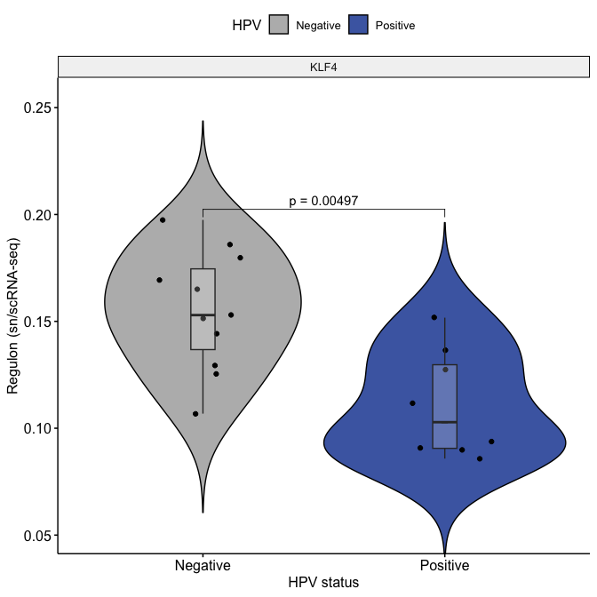
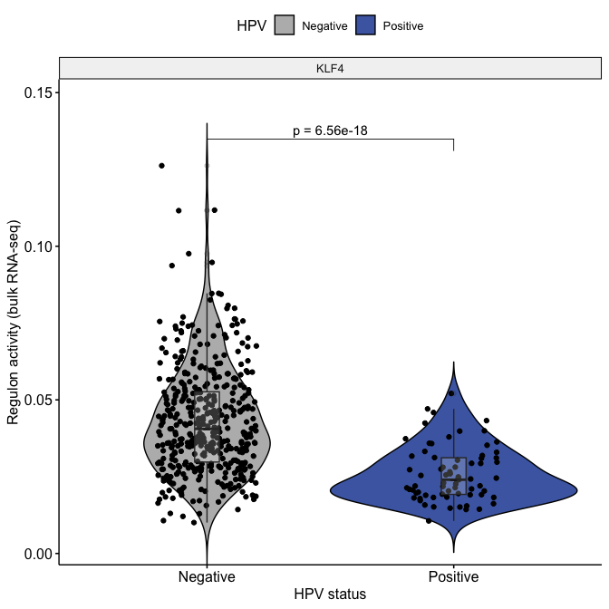

Figure 7h, Regulon activity of KLF4 in HPV-positive and HPV-negative
HNSCC, both in this study (upper panel) and in TCGA dataset (lower
panel)
================

# 0. Load library

``` r
library(tidyverse)
library(corrplot)
library(grDevices)
library(ggpubr)
library(rstatix)
```

# 1.Prepare input data

``` r
#data_all <- readRDS("./data/Regulon/Tumor_regulonActivity_v20230201_clinical_v5.rds")
data_all <-readRDS("~/Library/CloudStorage/Box-Box/Ding_Lab/Projects_Current/PanCan_snATAC/Github/data/Regulon/Tumor_regulonActivity_v20230201_clinical_v5.rds")
regulon <- read.delim("~/Library/CloudStorage/Box-Box/Ding_Lab/Projects_Current/PanCan_snATAC/Github/data/Regulon/regulonActivity_perPieceID_TumorCells.NormalCombined.20230201.tsv")
#regulon <- read.delim("./data/Regulon/regulonActivity_perPieceID_TumorCells.NormalCombined.20230201.tsv")
row.names(regulon) <- gsub("\\(\\+\\)", "", row.names(regulon))

# convert row names to a column
regulon <- rownames_to_column(regulon, var = "regulon")
TF_list <-unique(regulon$regulon)
```

# 2.Plot Figure 7h

``` r
df <-data_all %>% filter(disease_type %in% c("HNSCC")) 

# create a new data frame with selected columns and HPV status

df_selected <-df %>% dplyr::select(c("KLF4","hpv")) 

# reshape data into long format for box plot
df_long <- reshape2::melt(df_selected, id.vars = "hpv")
colnames(df_long)<-c("HPV","Regulon","value")
df <-df_long

### calculate P values
# Wilcoxon Tests, add FDR adjusted p value
stat.test <-df %>%
  group_by(Regulon) %>%
  wilcox_test(value ~ HPV)%>%
  adjust_pvalue(method = "fdr") %>%
  add_significance()
stat.test$p.adj <-signif(stat.test$p.adj, digits = 3)
stat.test$p <-signif(stat.test$p, digits = 3)
stat.test <- stat.test %>% add_xy_position(x = "HPV")

# Wilcoxon test with unadjusted p value
p1 <- ggviolin(df, x = "HPV", y = "value", 
              fill = "HPV",
              ylab = "Regulon (sn/scRNA-seq)",
              xlab = "HPV status",
              palette = c("#b9b9b9", "#4b69b1"),
              order = c("Negative", "Positive"),
              add = "jitter") +
  stat_summary(fun = median, geom = "point", shape = 95, size = 3, color = "black", position = position_dodge(0.75)) +
  geom_boxplot(width=0.1, fill="white", alpha=0.2) +
  stat_pvalue_manual(
    stat.test, bracket.nudge.y = 0, hide.ns = FALSE,
    label = "p = {p}"
  ) +
  scale_y_continuous(expand = expansion(mult = c(0.0, 0.1)))+
  facet_wrap(~Regulon)


# plot figure
print(p1)
```

<!-- -->

``` r
#save figure to pdf
out_dir <- './figures/'
pdf(paste(out_dir, "Fig7h_1_violin_HNSCC_HPV_KLF4_Wilcoxon_p.pdf", sep = ""), onefile = TRUE, width = 4, height = 5)
print(p1)
dev.off()
```

    ## quartz_off_screen 
    ##                 2

``` r
# validate in TCGA cohort
df <-readRDS("~/Library/CloudStorage/Box-Box/Wash U/PhD/Rotation/DingLab/project/Pancan_snATAC/Analysis/Fig3_clinical/TCGA_HNSCC_validation_set.rds")%>%drop_na(HPV)

# create a new data frame with selected columns and IDH methylation status

df_selected <-df %>% select(c(`KLF4(+)`,"HPV")) # 83:128 are histone acetylation sites

colnames(df_selected)[1] <-"KLF4"

# reshape data into long format for box plot
df_long <- reshape2::melt(df_selected, id.vars = "HPV")
colnames(df_long)<-c("HPV","Regulon","value")
df <-df_long
df <-df %>%drop_na(HPV)

### calculate P values
# Wilcoxon Tests, add FDR adjusted p value

stat.test <-df %>%
  group_by(Regulon) %>%
  wilcox_test(value ~ HPV)%>%
  adjust_pvalue(method = "fdr") %>%
  add_significance()
stat.test$p.adj <-signif(stat.test$p.adj, digits = 3)
stat.test$p <-signif(stat.test$p, digits = 3)
stat.test <- stat.test %>% add_xy_position(x = "HPV")

# Wilcoxon test with unadjusted p value
p2<-ggviolin(df, x = "HPV", y = "value", fill = "HPV",
              ylab = "Regulon activity (bulk RNA-seq)",
              xlab = "HPV status",
              palette = c("#b9b9b9", "#4b69b1"),
              order = c("Negative", "Positive"),
              add = "jitter")+
  geom_boxplot(width=0.1, fill="white",alpha=0.2)+
  stat_summary(fun = median, geom = "point", shape = 95, size = 3, color = "black", position = position_dodge(0.75)) +
  #facet_wrap((~factor(Regulon, levels=unique(df$Regulon))), scale="free")+ 
  stat_pvalue_manual(
    stat.test, bracket.nudge.y = 0, hide.ns = FALSE,
    label = "p = {p}"
  ) +
  
  scale_y_continuous(expand = expansion(mult = c(0.0, 0.1)))+
  facet_wrap(~Regulon)

# plot figure
print(p2)
```

<!-- -->

``` r
#save figure to pdf
pdf(paste(out_dir, "Fig7h_1_violin_TGGA_HNSCC_HPV_KLF4_Wilcoxon_p.pdf", sep = ""), onefile = TRUE, width = 4, height = 4)
print(p2)
dev.off()
```

    ## quartz_off_screen 
    ##                 2
