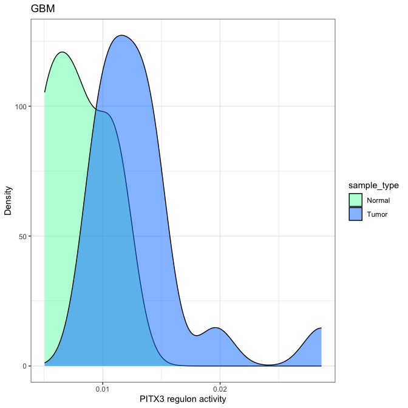
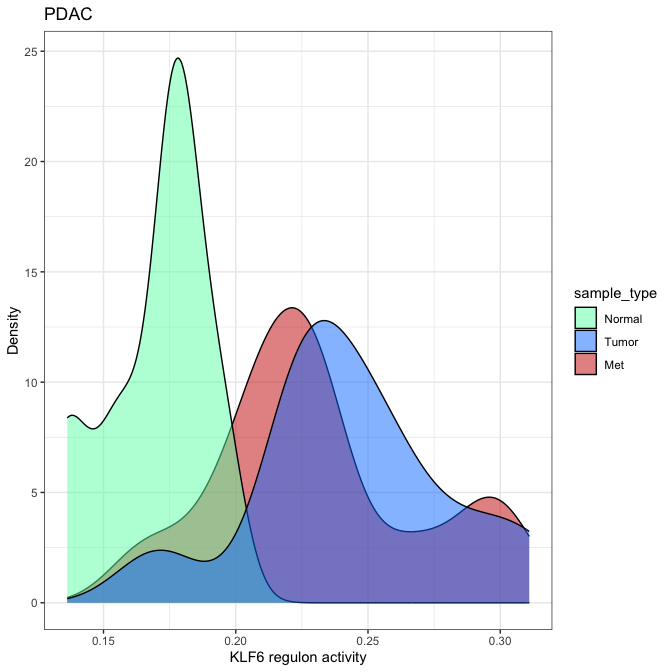

Figure 7f, Regulon activities of PITX3 in GBM and KLF6 in PDAC are shown
across normal (green), primary (blue), and metastasis (red) cells
================

# 0. Load library

``` r
library(tidyverse)
```

# 1.Prepare input data

``` r
#data_all <- readRDS("./data/Regulon/Tumor_regulonActivity_v20230201_clinical_v5.rds")
data_all <-readRDS("~/Library/CloudStorage/Box-Box/Ding_Lab/Projects_Current/PanCan_snATAC/Github/data/Regulon/Tumor_regulonActivity_v20230201_clinical_v5.rds")
regulon <- read.delim("~/Library/CloudStorage/Box-Box/Ding_Lab/Projects_Current/PanCan_snATAC/Github/data/Regulon/regulonActivity_perPieceID_TumorCells.NormalCombined.20230201.tsv")
#regulon <- read.delim("./data/Regulon/regulonActivity_perPieceID_TumorCells.NormalCombined.20230201.tsv")
row.names(regulon) <- gsub("\\(\\+\\)", "", row.names(regulon))

# convert row names to a column
regulon <- rownames_to_column(regulon, var = "regulon")
TF_list <-unique(regulon$regulon)

head(data_all)
```

    ##                  cell_type     piece_id cell_cat
    ## 1 BRCA_HT029B1.S1PC__Tumor HT029B1-S1PC    Tumor
    ## 2 BRCA_HT035B1.S1PA__Tumor HT035B1-S1PA    Tumor
    ## 3 BRCA_HT088B1.S1H1__Tumor HT088B1-S1H1    Tumor
    ## 4 BRCA_HT128B1.S1H4__Tumor HT128B1-S1H4    Tumor
    ## 5 BRCA_HT137B1.S1H7__Tumor HT137B1-S1H7    Tumor
    ## 6 BRCA_HT141B1.S1H1__Tumor HT141B1-S1H1    Tumor
    ##                          sample_id disease_type case_id
    ## 1                TWCE-HT029B1-XBa1   BRCA_Basal HT029B1
    ## 2                 TWCE-HT035B-XBa1   BRCA_Basal  HT035B
    ## 3   TWCE-HT088B1-S1H1A2K2Y2N1-ATAC         BRCA HT088B1
    ## 4 TWCE-HT128B1-XBa2_1-HT128B1-XBa2         BRCA HT128B1
    ## 5                TWCE-HT137B1-XBa1         BRCA HT137B1
    ## 6                TWCE-HT141B1-XBa1   BRCA_Basal HT141B1
    ##   include_in_the_downstream_analysis include_in_immune sample_type data_type
    ## 1                               TRUE              TRUE       Tumor    snATAC
    ## 2                               TRUE              TRUE       Tumor    snATAC
    ## 3                               TRUE              TRUE       Tumor    snATAC
    ## 4                               TRUE              TRUE       Tumor    snATAC
    ## 5                               TRUE              TRUE       Tumor    snATAC
    ## 6                               TRUE              TRUE       Tumor    snATAC
    ##                                                                                                                                                   data_folder
    ## 1                /diskmnt/Projects/snATAC_primary/PanCan_ATAC_data_freeze/v5.0/snATAC/Individual_objects/RDS.30PCs/snATAC_objects/BRCA/BRCA_TWCE-HT029B1-XBa1
    ## 2                 /diskmnt/Projects/snATAC_primary/PanCan_ATAC_data_freeze/v5.0/snATAC/Individual_objects/RDS.30PCs/snATAC_objects/BRCA/BRCA_TWCE-HT035B-XBa1
    ## 3   /diskmnt/Projects/snATAC_primary/PanCan_ATAC_data_freeze/v5.0/snATAC/Individual_objects/RDS.30PCs/snATAC_objects/BRCA/BRCA_TWCE-HT088B1-S1H1A2K2Y2N1-ATAC
    ## 4 /diskmnt/Projects/snATAC_primary/PanCan_ATAC_data_freeze/v5.0/snATAC/Individual_objects/RDS.30PCs/snATAC_objects/BRCA/BRCA_TWCE-HT128B1-XBa2_1-HT128B1-XBa2
    ## 5                /diskmnt/Projects/snATAC_primary/PanCan_ATAC_data_freeze/v5.0/snATAC/Individual_objects/RDS.30PCs/snATAC_objects/BRCA/BRCA_TWCE-HT137B1-XBa1
    ## 6                /diskmnt/Projects/snATAC_primary/PanCan_ATAC_data_freeze/v5.0/snATAC/Individual_objects/RDS.30PCs/snATAC_objects/BRCA/BRCA_TWCE-HT141B1-XBa1
    ##   cellranger_version                                sample chemistry
    ## 1               v2.0                BRCA_TWCE-HT029B1-XBa1    snATAC
    ## 2               v2.0                 BRCA_TWCE-HT035B-XBa1    snATAC
    ## 3               v2.0   BRCA_TWCE-HT088B1-S1H1A2K2Y2N1-ATAC    snATAC
    ## 4               v2.0 BRCA_TWCE-HT128B1-XBa2_1-HT128B1-XBa2    snATAC
    ## 5               v2.0                BRCA_TWCE-HT137B1-XBa1    snATAC
    ## 6               v2.0                BRCA_TWCE-HT141B1-XBa1    snATAC
    ##   clinical_available                              clinical_file age
    ## 1                Yes HTAN_BRCA_senescence_cohort_v20221114.xlsx  71
    ## 2                Yes HTAN_BRCA_senescence_cohort_v20221114.xlsx  62
    ## 3                Yes HTAN_BRCA_senescence_cohort_v20221114.xlsx  62
    ## 4                Yes HTAN_BRCA_senescence_cohort_v20221114.xlsx  72
    ## 5                Yes HTAN_BRCA_senescence_cohort_v20221114.xlsx  48
    ## 6                Yes HTAN_BRCA_senescence_cohort_v20221114.xlsx  54
    ##               race    ethnicity sex ancestry_identified
    ## 1 African American Non_Hispanic   F                <NA>
    ## 2            White Non_Hispanic   F                <NA>
    ## 3            White Non_Hispanic   F                <NA>
    ## 4 African American Non_Hispanic   F                <NA>
    ## 5            White Non_Hispanic   F                <NA>
    ## 6            White Non_Hispanic   F                <NA>
    ##                                    treatment medication treatment_2
    ## 1                                       None       None           0
    ## 2                                       None       None           0
    ## 3                                       None       None           0
    ## 4                                       None       None           0
    ## 5                                       None       None           0
    ## 6 paclitaxel and Adriamycin/Cyclophosphamide      Chemo           1
    ##         smoking       alcohol smoking_cat alcohol_cat vital_1_dead_0_alive
    ## 1 former smoker   non-drinker           1           0                   NA
    ## 2 former smoker   non-drinker           1           0                   NA
    ## 3    non-smoker heavy drinker           0           2                   NA
    ## 4    non-smoker   non-drinker           0           0                   NA
    ## 5 former smoker heavy drinker           1           2                   NA
    ## 6    non-smoker heavy drinker           0           2                   NA
    ##   vital   os pfs clinical_subtype iss_stage data_type_2 sn_atac sc_sn_rna wes_t
    ## 1  <NA> <NA>  NA                0         0      snATAC     Yes       Yes   Yes
    ## 2  <NA> <NA>  NA             TNBC       cT2      snATAC     Yes       Yes   Yes
    ## 3  <NA> <NA>  NA     ER+PR+ Her2-       pT2      snATAC     Yes       Yes   Yes
    ## 4  <NA> <NA>  NA   ER+ PR- Her2 -       pT2      snATAC     Yes       Yes   Yes
    ## 5  <NA> <NA>  NA   ER+, PR+ Her2-       pT3      snATAC     Yes       Yes   Yes
    ## 6  <NA> <NA>  NA             TNBC       pT2      snATAC     Yes       Yes   Yes
    ##   wes_n cancer_type censor_1_censored ttpd site subsite
    ## 1   Yes        HTAN                NA   NA <NA>    <NA>
    ## 2   Yes        HTAN                NA   NA <NA>    <NA>
    ## 3    No        HTAN                NA   NA <NA>    <NA>
    ## 4   Yes        HTAN                NA   NA <NA>    <NA>
    ## 5   Yes        HTAN                NA   NA <NA>    <NA>
    ## 6    No        HTAN                NA   NA <NA>    <NA>
    ##   time_from_diagnosis_to_surgery_weeks diagnosis_notes age_death grade
    ## 1                                    4            <NA>        NA  <NA>
    ## 2                                    4            <NA>        NA  <NA>
    ## 3                                   10            <NA>        NA  <NA>
    ## 4                                    8            <NA>        NA  <NA>
    ## 5                                    8            <NA>        NA  <NA>
    ## 6                                   24            <NA>        NA  <NA>
    ##   pertinent_medical_history consent_age consent_sex consent_race
    ## 1                      <NA>          NA        <NA>         <NA>
    ## 2                      <NA>          NA        <NA>         <NA>
    ## 3                      <NA>          NA        <NA>         <NA>
    ## 4                      <NA>          NA        <NA>         <NA>
    ## 5                      <NA>          NA        <NA>         <NA>
    ## 6                      <NA>          NA        <NA>         <NA>
    ##   consent_ethnicity consent_ethnicity_race_ancestry_identified
    ## 1              <NA>                                       <NA>
    ## 2              <NA>                                       <NA>
    ## 3              <NA>                                       <NA>
    ## 4              <NA>                                       <NA>
    ## 5              <NA>                                       <NA>
    ## 6              <NA>                                       <NA>
    ##   inferred_ancestry consent_collection_in_us consent_participant_country
    ## 1              <NA>                     <NA>                        <NA>
    ## 2              <NA>                     <NA>                        <NA>
    ## 3              <NA>                     <NA>                        <NA>
    ## 4              <NA>                     <NA>                        <NA>
    ## 5              <NA>                     <NA>                        <NA>
    ## 6              <NA>                     <NA>                        <NA>
    ##   consent_materl_grandmother_country consent_materl_grandfather_country
    ## 1                               <NA>                               <NA>
    ## 2                               <NA>                               <NA>
    ## 3                               <NA>                               <NA>
    ## 4                               <NA>                               <NA>
    ## 5                               <NA>                               <NA>
    ## 6                               <NA>                               <NA>
    ##   consent_paterl_grandmother_country consent_paterl_grandfather_country
    ## 1                               <NA>                               <NA>
    ## 2                               <NA>                               <NA>
    ## 3                               <NA>                               <NA>
    ## 4                               <NA>                               <NA>
    ## 5                               <NA>                               <NA>
    ## 6                               <NA>                               <NA>
    ##   consent_deaf_or_difficulty_hearing consent_blind_or_difficulty_seeing
    ## 1                               <NA>                               <NA>
    ## 2                               <NA>                               <NA>
    ## 3                               <NA>                               <NA>
    ## 4                               <NA>                               <NA>
    ## 5                               <NA>                               <NA>
    ## 6                               <NA>                               <NA>
    ##   consent_difficulty_concentrating_remembering_or_making_decisions
    ## 1                                                             <NA>
    ## 2                                                             <NA>
    ## 3                                                             <NA>
    ## 4                                                             <NA>
    ## 5                                                             <NA>
    ## 6                                                             <NA>
    ##   consent_difficulty_walking_or_climbing_stairs
    ## 1                                          <NA>
    ## 2                                          <NA>
    ## 3                                          <NA>
    ## 4                                          <NA>
    ## 5                                          <NA>
    ## 6                                          <NA>
    ##   consent_difficulty_dressing_or_bathing consent_difficulty_doing_errands
    ## 1                                   <NA>                             <NA>
    ## 2                                   <NA>                             <NA>
    ## 3                                   <NA>                             <NA>
    ## 4                                   <NA>                             <NA>
    ## 5                                   <NA>                             <NA>
    ## 6                                   <NA>                             <NA>
    ##   consent_consent_form_signed consent_case_stopped baseline_tumor_site
    ## 1                        <NA>                 <NA>                <NA>
    ## 2                        <NA>                 <NA>                <NA>
    ## 3                        <NA>                 <NA>                <NA>
    ## 4                        <NA>                 <NA>                <NA>
    ## 5                        <NA>                 <NA>                <NA>
    ## 6                        <NA>                 <NA>                <NA>
    ##   baseline_tumor_site_other baseline_tumor_laterality baseline_tumor_focality
    ## 1                      <NA>                      <NA>                    <NA>
    ## 2                      <NA>                      <NA>                    <NA>
    ## 3                      <NA>                      <NA>                    <NA>
    ## 4                      <NA>                      <NA>                    <NA>
    ## 5                      <NA>                      <NA>                    <NA>
    ## 6                      <NA>                      <NA>                    <NA>
    ##   baseline_tumor_size_cm baseline_histologic_type cptac_path_histologic_grade
    ## 1                     NA                     <NA>                        <NA>
    ## 2                     NA                     <NA>                        <NA>
    ## 3                     NA                     <NA>                        <NA>
    ## 4                     NA                     <NA>                        <NA>
    ## 5                     NA                     <NA>                        <NA>
    ## 6                     NA                     <NA>                        <NA>
    ##   baseline_tumor_necrosis baseline_margin_status
    ## 1                    <NA>                   <NA>
    ## 2                    <NA>                   <NA>
    ## 3                    <NA>                   <NA>
    ## 4                    <NA>                   <NA>
    ## 5                    <NA>                   <NA>
    ## 6                    <NA>                   <NA>
    ##   baseline_ajcc_tnm_cancer_staging_edition_used
    ## 1                                          <NA>
    ## 2                                          <NA>
    ## 3                                          <NA>
    ## 4                                          <NA>
    ## 5                                          <NA>
    ## 6                                          <NA>
    ##   baseline_pathologic_staging_primary_tumor_pt
    ## 1                                         <NA>
    ## 2                                         <NA>
    ## 3                                         <NA>
    ## 4                                         <NA>
    ## 5                                         <NA>
    ## 6                                         <NA>
    ##   baseline_pathologic_staging_regiol_lymph_nodes_pn
    ## 1                                              <NA>
    ## 2                                              <NA>
    ## 3                                              <NA>
    ## 4                                              <NA>
    ## 5                                              <NA>
    ## 6                                              <NA>
    ##   baseline_number_of_lymph_nodes_examined
    ## 1                                      NA
    ## 2                                      NA
    ## 3                                      NA
    ## 4                                      NA
    ## 5                                      NA
    ## 6                                      NA
    ##   baseline_number_of_lymph_nodes_positive_for_tumor_by_he_staining
    ## 1                                                               NA
    ## 2                                                               NA
    ## 3                                                               NA
    ## 4                                                               NA
    ## 5                                                               NA
    ## 6                                                               NA
    ##   baseline_clinical_staging_distant_metastasis_cm
    ## 1                                            <NA>
    ## 2                                            <NA>
    ## 3                                            <NA>
    ## 4                                            <NA>
    ## 5                                            <NA>
    ## 6                                            <NA>
    ##   baseline_pathologic_staging_distant_metastasis_pm
    ## 1                                              <NA>
    ## 2                                              <NA>
    ## 3                                              <NA>
    ## 4                                              <NA>
    ## 5                                              <NA>
    ## 6                                              <NA>
    ##   baseline_specify_distant_metastasis_documented_sites baseline_residual_tumor
    ## 1                                                 <NA>                    <NA>
    ## 2                                                 <NA>                    <NA>
    ## 3                                                 <NA>                    <NA>
    ## 4                                                 <NA>                    <NA>
    ## 5                                                 <NA>                    <NA>
    ## 6                                                 <NA>                    <NA>
    ##   baseline_tumor_stage_pathological baseline_paraneoplastic_syndrome_present
    ## 1                              <NA>                                     <NA>
    ## 2                              <NA>                                     <NA>
    ## 3                              <NA>                                     <NA>
    ## 4                              <NA>                                     <NA>
    ## 5                              <NA>                                     <NA>
    ## 6                              <NA>                                     <NA>
    ##   baseline_ancillary_studies_immunohistochemistry_performed
    ## 1                                                      <NA>
    ## 2                                                      <NA>
    ## 3                                                      <NA>
    ## 4                                                      <NA>
    ## 5                                                      <NA>
    ## 6                                                      <NA>
    ##   baseline_ancillary_studies_immunohistochemistry_type_and_result
    ## 1                                                            <NA>
    ## 2                                                            <NA>
    ## 3                                                            <NA>
    ## 4                                                            <NA>
    ## 5                                                            <NA>
    ## 6                                                            <NA>
    ##   baseline_ancillary_studies_other_testing_performed
    ## 1                                               <NA>
    ## 2                                               <NA>
    ## 3                                               <NA>
    ## 4                                               <NA>
    ## 5                                               <NA>
    ## 6                                               <NA>
    ##   baseline_ancillary_studies_other_testing_type_and_result
    ## 1                                                     <NA>
    ## 2                                                     <NA>
    ## 3                                                     <NA>
    ## 4                                                     <NA>
    ## 5                                                     <NA>
    ## 6                                                     <NA>
    ##   baseline_performance_status_assessment_ecog_performance_status_score
    ## 1                                                                 <NA>
    ## 2                                                                 <NA>
    ## 3                                                                 <NA>
    ## 4                                                                 <NA>
    ## 5                                                                 <NA>
    ## 6                                                                 <NA>
    ##   baseline_performance_status_assessment_karnofsky_performance_status_score
    ## 1                                                                      <NA>
    ## 2                                                                      <NA>
    ## 3                                                                      <NA>
    ## 4                                                                      <NA>
    ## 5                                                                      <NA>
    ## 6                                                                      <NA>
    ##   baseline_number_of_lymph_nodes_positive_for_tumor_by_ihc_staining
    ## 1                                                              <NA>
    ## 2                                                              <NA>
    ## 3                                                              <NA>
    ## 4                                                              <NA>
    ## 5                                                              <NA>
    ## 6                                                              <NA>
    ##   baseline_perineural_invasion medical_history_height_at_time_of_surgery_cm
    ## 1                           NA                                           NA
    ## 2                           NA                                           NA
    ## 3                           NA                                           NA
    ## 4                           NA                                           NA
    ## 5                           NA                                           NA
    ## 6                           NA                                           NA
    ##   medical_history_weight_at_time_of_surgery_kg medical_history_bmi
    ## 1                                           NA                  NA
    ## 2                                           NA                  NA
    ## 3                                           NA                  NA
    ## 4                                           NA                  NA
    ## 5                                           NA                  NA
    ## 6                                           NA                  NA
    ##   medical_history_history_of_cancer medical_history_alcohol_consumption
    ## 1                              <NA>                                <NA>
    ## 2                              <NA>                                <NA>
    ## 3                              <NA>                                <NA>
    ## 4                              <NA>                                <NA>
    ## 5                              <NA>                                <NA>
    ## 6                              <NA>                                <NA>
    ##   medical_history_tobacco_smoking_history
    ## 1                                    <NA>
    ## 2                                    <NA>
    ## 3                                    <NA>
    ## 4                                    <NA>
    ## 5                                    <NA>
    ## 6                                    <NA>
    ##   medical_history_age_at_which_the_participant_started_smoking
    ## 1                                                           NA
    ## 2                                                           NA
    ## 3                                                           NA
    ## 4                                                           NA
    ## 5                                                           NA
    ## 6                                                           NA
    ##   medical_history_age_at_which_the_participant_stopped_smoking
    ## 1                                                           NA
    ## 2                                                           NA
    ## 3                                                           NA
    ## 4                                                           NA
    ## 5                                                           NA
    ## 6                                                           NA
    ##   medical_history_on_the_days_participant_smoked_how_many_cigarettes_did_he_she_usually_smoke
    ## 1                                                                                          NA
    ## 2                                                                                          NA
    ## 3                                                                                          NA
    ## 4                                                                                          NA
    ## 5                                                                                          NA
    ## 6                                                                                          NA
    ##   medical_history_number_of_pack_years_smoked
    ## 1                                          NA
    ## 2                                          NA
    ## 3                                          NA
    ## 4                                          NA
    ## 5                                          NA
    ## 6                                          NA
    ##   medical_history_was_the_participant_exposed_to_secondhand_smoke
    ## 1                                                            <NA>
    ## 2                                                            <NA>
    ## 3                                                            <NA>
    ## 4                                                            <NA>
    ## 5                                                            <NA>
    ## 6                                                            <NA>
    ##   medical_history_exposure_to_secondhand_smoke_in_household_during_participants_childhood
    ## 1                                                                                    <NA>
    ## 2                                                                                    <NA>
    ## 3                                                                                    <NA>
    ## 4                                                                                    <NA>
    ## 5                                                                                    <NA>
    ## 6                                                                                    <NA>
    ##   medical_history_exposure_to_secondhand_smoke_in_participants_current_household
    ## 1                                                                             NA
    ## 2                                                                             NA
    ## 3                                                                             NA
    ## 4                                                                             NA
    ## 5                                                                             NA
    ## 6                                                                             NA
    ##   medical_history_number_of_years_participant_has_consumed_more_than_2_drinks_per_day_for_men_and_more_than_1_drink_per_day_for_women
    ## 1                                                                                                                                <NA>
    ## 2                                                                                                                                <NA>
    ## 3                                                                                                                                <NA>
    ## 4                                                                                                                                <NA>
    ## 5                                                                                                                                <NA>
    ## 6                                                                                                                                <NA>
    ##   cancer_history_cancer_type cancer_history_history_source
    ## 1                       <NA>                          <NA>
    ## 2                       <NA>                          <NA>
    ## 3                       <NA>                          <NA>
    ## 4                       <NA>                          <NA>
    ## 5                       <NA>                          <NA>
    ## 6                       <NA>                          <NA>
    ##   cancer_history_history_of_any_treatment
    ## 1                                    <NA>
    ## 2                                    <NA>
    ## 3                                    <NA>
    ## 4                                    <NA>
    ## 5                                    <NA>
    ## 6                                    <NA>
    ##   cancer_history_medical_record_documentation_of_this_history_of_cancer_and_treatment
    ## 1                                                                                <NA>
    ## 2                                                                                <NA>
    ## 3                                                                                <NA>
    ## 4                                                                                <NA>
    ## 5                                                                                <NA>
    ## 6                                                                                <NA>
    ##   general_medical_history_medical_condition
    ## 1                                      <NA>
    ## 2                                      <NA>
    ## 3                                      <NA>
    ## 4                                      <NA>
    ## 5                                      <NA>
    ## 6                                      <NA>
    ##   general_medical_history_history_of_treatment
    ## 1                                         <NA>
    ## 2                                         <NA>
    ## 3                                         <NA>
    ## 4                                         <NA>
    ## 5                                         <NA>
    ## 6                                         <NA>
    ##   general_medical_history_history_source
    ## 1                                   <NA>
    ## 2                                   <NA>
    ## 3                                   <NA>
    ## 4                                   <NA>
    ## 5                                   <NA>
    ## 6                                   <NA>
    ##   medications_medication_me_vitamins_supplements medications_history_source
    ## 1                                           <NA>                       <NA>
    ## 2                                           <NA>                       <NA>
    ## 3                                           <NA>                       <NA>
    ## 4                                           <NA>                       <NA>
    ## 5                                           <NA>                       <NA>
    ## 6                                           <NA>                       <NA>
    ##   procurement_blood_collection_minimum_required_blood_collected
    ## 1                                                          <NA>
    ## 2                                                          <NA>
    ## 3                                                          <NA>
    ## 4                                                          <NA>
    ## 5                                                          <NA>
    ## 6                                                          <NA>
    ##   procurement_blood_collection_number_of_blood_tubes_collected
    ## 1                                                           NA
    ## 2                                                           NA
    ## 3                                                           NA
    ## 4                                                           NA
    ## 5                                                           NA
    ## 6                                                           NA
    ##   procurement_tumor_tissue_collection_tumor_type
    ## 1                                           <NA>
    ## 2                                           <NA>
    ## 3                                           <NA>
    ## 4                                           <NA>
    ## 5                                           <NA>
    ## 6                                           <NA>
    ##   procurement_tumor_tissue_collection_number_of_tumor_segments_collected
    ## 1                                                                     NA
    ## 2                                                                     NA
    ## 3                                                                     NA
    ## 4                                                                     NA
    ## 5                                                                     NA
    ## 6                                                                     NA
    ##   procurement_tumor_tissue_collection_clamps_used
    ## 1                                            <NA>
    ## 2                                            <NA>
    ## 3                                            <NA>
    ## 4                                            <NA>
    ## 5                                            <NA>
    ## 6                                            <NA>
    ##   procurement_tumor_tissue_collection_frozen_with_oct
    ## 1                                                <NA>
    ## 2                                                <NA>
    ## 3                                                <NA>
    ## 4                                                <NA>
    ## 5                                                <NA>
    ## 6                                                <NA>
    ##   procurement_normal_adjacent_tissue_collection_number_of_normal_segments_collected
    ## 1                                                                                NA
    ## 2                                                                                NA
    ## 3                                                                                NA
    ## 4                                                                                NA
    ## 5                                                                                NA
    ## 6                                                                                NA
    ##   follow_up_follow_up_period follow_up_is_this_patient_lost_to_follow_up
    ## 1                       <NA>                                        <NA>
    ## 2                       <NA>                                        <NA>
    ## 3                       <NA>                                        <NA>
    ## 4                       <NA>                                        <NA>
    ## 5                       <NA>                                        <NA>
    ## 6                       <NA>                                        <NA>
    ##   follow_up_vital_status_at_date_of_last_contact
    ## 1                                           <NA>
    ## 2                                           <NA>
    ## 3                                           <NA>
    ## 4                                           <NA>
    ## 5                                           <NA>
    ## 6                                           <NA>
    ##   follow_up_number_of_days_from_date_of_initial_pathologic_diagnosis_to_date_of_last_contact
    ## 1                                                                                         NA
    ## 2                                                                                         NA
    ## 3                                                                                         NA
    ## 4                                                                                         NA
    ## 5                                                                                         NA
    ## 6                                                                                         NA
    ##   follow_up_number_of_days_from_date_of_initial_pathologic_diagnosis_to_date_of_death
    ## 1                                                                                  NA
    ## 2                                                                                  NA
    ## 3                                                                                  NA
    ## 4                                                                                  NA
    ## 5                                                                                  NA
    ## 6                                                                                  NA
    ##   follow_up_cause_of_death
    ## 1                     <NA>
    ## 2                     <NA>
    ## 3                     <NA>
    ## 4                     <NA>
    ## 5                     <NA>
    ## 6                     <NA>
    ##   follow_up_number_of_days_from_date_of_collection_to_date_of_last_contact
    ## 1                                                                       NA
    ## 2                                                                       NA
    ## 3                                                                       NA
    ## 4                                                                       NA
    ## 5                                                                       NA
    ## 6                                                                       NA
    ##   follow_up_number_of_days_from_date_of_collection_to_date_of_death
    ## 1                                                                NA
    ## 2                                                                NA
    ## 3                                                                NA
    ## 4                                                                NA
    ## 5                                                                NA
    ## 6                                                                NA
    ##   follow_up_adjuvant_post_operative_radiation_therapy
    ## 1                                                <NA>
    ## 2                                                <NA>
    ## 3                                                <NA>
    ## 4                                                <NA>
    ## 5                                                <NA>
    ## 6                                                <NA>
    ##   follow_up_adjuvant_post_operative_pharmaceutical_therapy
    ## 1                                                     <NA>
    ## 2                                                     <NA>
    ## 3                                                     <NA>
    ## 4                                                     <NA>
    ## 5                                                     <NA>
    ## 6                                                     <NA>
    ##   follow_up_adjuvant_post_operative_immunological_therapy
    ## 1                                                    <NA>
    ## 2                                                    <NA>
    ## 3                                                    <NA>
    ## 4                                                    <NA>
    ## 5                                                    <NA>
    ## 6                                                    <NA>
    ##   follow_up_tumor_status_at_date_of_last_contact_or_death
    ## 1                                                    <NA>
    ## 2                                                    <NA>
    ## 3                                                    <NA>
    ## 4                                                    <NA>
    ## 5                                                    <NA>
    ## 6                                                    <NA>
    ##   follow_up_measure_of_success_of_outcome_at_the_completion_of_initial_first_course_treatment
    ## 1                                                                                        <NA>
    ## 2                                                                                        <NA>
    ## 3                                                                                        <NA>
    ## 4                                                                                        <NA>
    ## 5                                                                                        <NA>
    ## 6                                                                                        <NA>
    ##   follow_up_measure_of_success_of_outcome_at_date_of_last_contact_or_death
    ## 1                                                                     <NA>
    ## 2                                                                     <NA>
    ## 3                                                                     <NA>
    ## 4                                                                     <NA>
    ## 5                                                                     <NA>
    ## 6                                                                     <NA>
    ##   follow_up_ecog_performance_status_score_at_date_of_last_contact_or_death
    ## 1                                                                     <NA>
    ## 2                                                                     <NA>
    ## 3                                                                     <NA>
    ## 4                                                                     <NA>
    ## 5                                                                     <NA>
    ## 6                                                                     <NA>
    ##   follow_up_karnofsky_performance_status_score_at_date_of_last_contact_or_death
    ## 1                                                                          <NA>
    ## 2                                                                          <NA>
    ## 3                                                                          <NA>
    ## 4                                                                          <NA>
    ## 5                                                                          <NA>
    ## 6                                                                          <NA>
    ##   follow_up_performance_status_scale_timing_at_date_of_last_contact_or_death
    ## 1                                                                       <NA>
    ## 2                                                                       <NA>
    ## 3                                                                       <NA>
    ## 4                                                                       <NA>
    ## 5                                                                       <NA>
    ## 6                                                                       <NA>
    ##   follow_up_measure_of_success_of_outcome_at_first_nte
    ## 1                                                 <NA>
    ## 2                                                 <NA>
    ## 3                                                 <NA>
    ## 4                                                 <NA>
    ## 5                                                 <NA>
    ## 6                                                 <NA>
    ##   follow_up_ecog_performance_status_score_at_first_nte
    ## 1                                                 <NA>
    ## 2                                                 <NA>
    ## 3                                                 <NA>
    ## 4                                                 <NA>
    ## 5                                                 <NA>
    ## 6                                                 <NA>
    ##   follow_up_karnofsky_performance_status_score_at_first_nte
    ## 1                                                      <NA>
    ## 2                                                      <NA>
    ## 3                                                      <NA>
    ## 4                                                      <NA>
    ## 5                                                      <NA>
    ## 6                                                      <NA>
    ##   follow_up_performance_status_scale_timing_at_first_nte
    ## 1                                                   <NA>
    ## 2                                                   <NA>
    ## 3                                                   <NA>
    ## 4                                                   <NA>
    ## 5                                                   <NA>
    ## 6                                                   <NA>
    ##   follow_up_new_tumor_after_initial_treatment
    ## 1                                        <NA>
    ## 2                                        <NA>
    ## 3                                        <NA>
    ## 4                                        <NA>
    ## 5                                        <NA>
    ## 6                                        <NA>
    ##   follow_up_number_of_days_from_date_of_initial_pathologic_diagnosis_to_date_of_new_tumor_event_after_initial_treatment
    ## 1                                                                                                                    NA
    ## 2                                                                                                                    NA
    ## 3                                                                                                                    NA
    ## 4                                                                                                                    NA
    ## 5                                                                                                                    NA
    ## 6                                                                                                                    NA
    ##   follow_up_type_of_new_tumor follow_up_site_of_new_tumor
    ## 1                        <NA>                        <NA>
    ## 2                        <NA>                        <NA>
    ## 3                        <NA>                        <NA>
    ## 4                        <NA>                        <NA>
    ## 5                        <NA>                        <NA>
    ## 6                        <NA>                        <NA>
    ##   follow_up_other_site_of_new_tumor
    ## 1                              <NA>
    ## 2                              <NA>
    ## 3                              <NA>
    ## 4                              <NA>
    ## 5                              <NA>
    ## 6                              <NA>
    ##   follow_up_diagnostic_evidence_of_recurrence_or_relapse
    ## 1                                                     NA
    ## 2                                                     NA
    ## 3                                                     NA
    ## 4                                                     NA
    ## 5                                                     NA
    ## 6                                                     NA
    ##   follow_up_additiol_surgery_for_new_tumor_loco_regiol
    ## 1                                                 <NA>
    ## 2                                                 <NA>
    ## 3                                                 <NA>
    ## 4                                                 <NA>
    ## 5                                                 <NA>
    ## 6                                                 <NA>
    ##   follow_up_additiol_surgery_for_new_tumor_metastasis
    ## 1                                                <NA>
    ## 2                                                <NA>
    ## 3                                                <NA>
    ## 4                                                <NA>
    ## 5                                                <NA>
    ## 6                                                <NA>
    ##   follow_up_residual_tumor_after_surgery_for_new_tumor
    ## 1                                                 <NA>
    ## 2                                                 <NA>
    ## 3                                                 <NA>
    ## 4                                                 <NA>
    ## 5                                                 <NA>
    ## 6                                                 <NA>
    ##   follow_up_additiol_treatment_radiation_therapy_for_new_tumor
    ## 1                                                         <NA>
    ## 2                                                         <NA>
    ## 3                                                         <NA>
    ## 4                                                         <NA>
    ## 5                                                         <NA>
    ## 6                                                         <NA>
    ##   follow_up_additiol_treatment_pharmaceutical_therapy_for_new_tumor
    ## 1                                                              <NA>
    ## 2                                                              <NA>
    ## 3                                                              <NA>
    ## 4                                                              <NA>
    ## 5                                                              <NA>
    ## 6                                                              <NA>
    ##   follow_up_additiol_treatment_immuno_for_new_tumor
    ## 1                                              <NA>
    ## 2                                              <NA>
    ## 3                                              <NA>
    ## 4                                              <NA>
    ## 5                                              <NA>
    ## 6                                              <NA>
    ##   follow_up_number_of_days_from_date_of_initial_pathologic_diagnosis_to_date_of_additiol_surgery_for_new_tumor_event_loco_regiol
    ## 1                                                                                                                             NA
    ## 2                                                                                                                             NA
    ## 3                                                                                                                             NA
    ## 4                                                                                                                             NA
    ## 5                                                                                                                             NA
    ## 6                                                                                                                             NA
    ##   follow_up_number_of_days_from_date_of_initial_pathologic_diagnosis_to_date_of_additiol_surgery_for_new_tumor_event_metastasis
    ## 1                                                                                                                            NA
    ## 2                                                                                                                            NA
    ## 3                                                                                                                            NA
    ## 4                                                                                                                            NA
    ## 5                                                                                                                            NA
    ## 6                                                                                                                            NA
    ##   recurrence_free_survival_days recurrence_free_survival_from_collection_days
    ## 1                            NA                                            NA
    ## 2                            NA                                            NA
    ## 3                            NA                                            NA
    ## 4                            NA                                            NA
    ## 5                            NA                                            NA
    ## 6                            NA                                            NA
    ##   recurrence_status_1_yes_0_no overall_survival_days
    ## 1                           NA                    NA
    ## 2                           NA                    NA
    ## 3                           NA                    NA
    ## 4                           NA                    NA
    ## 5                           NA                    NA
    ## 6                           NA                    NA
    ##   overall_survival_from_collection_days survival_status_1_dead_0_alive
    ## 1                                    NA                             NA
    ## 2                                    NA                             NA
    ## 3                                    NA                             NA
    ## 4                                    NA                             NA
    ## 5                                    NA                             NA
    ## 6                                    NA                             NA
    ##   recoded_recurrence_status recoded_recurrence_free_survival_days
    ## 1                        NA                                    NA
    ## 2                        NA                                    NA
    ## 3                        NA                                    NA
    ## 4                        NA                                    NA
    ## 5                        NA                                    NA
    ## 6                        NA                                    NA
    ##   recoded_recurrence_free_survival_from_collection_days  hpv       ARNT
    ## 1                                                    NA <NA> 0.07667396
    ## 2                                                    NA <NA> 0.07570064
    ## 3                                                    NA <NA> 0.07614715
    ## 4                                                    NA <NA> 0.09398137
    ## 5                                                    NA <NA> 0.08941160
    ## 6                                                    NA <NA> 0.07115954
    ##        ASCL1       ATF2      ATF3       ATF4      ATF6       ATF7       ATOH1
    ## 1 0.02209773 0.10319719 0.1352822 0.04306852 0.2714579 0.11700578 0.007663312
    ## 2 0.02553101 0.10230223 0.1444064 0.03737487 0.2642493 0.08357803 0.009982661
    ## 3 0.02472174 0.08400012 0.1294754 0.01918047 0.2528033 0.17576301 0.024299670
    ## 4 0.02445399 0.07895560 0.1071841 0.02234389 0.2309783 0.21291329 0.031730384
    ## 5 0.03862328 0.09300545 0.1451477 0.01968116 0.2955885 0.15531214 0.027888015
    ## 6 0.03731701 0.10116489 0.1233274 0.02654311 0.2815833 0.30187283 0.013213369
    ##        BACH2       BATF       BCL6     BHLHE22    BHLHE40       CDX1       CDX2
    ## 1 0.06125250 0.04372139 0.05530211 0.054025899 0.05978040 0.01775217 0.01583793
    ## 2 0.05332236 0.02859171 0.06284534 0.017818182 0.07025479 0.01728942 0.02361862
    ## 3 0.04100294 0.05087911 0.06787575 0.004990486 0.08240640 0.02895768 0.01908179
    ## 4 0.04393968 0.04163775 0.03992396 0.005032770 0.07796194 0.02342988 0.02377935
    ## 5 0.04781573 0.05686822 0.06594565 0.002345137 0.08866353 0.01989245 0.01803425
    ## 6 0.05450351 0.02646400 0.06247866 0.003548097 0.06298816 0.01521377 0.02712987
    ##          CEBPA      CEBPB      CEBPD       CEBPG      CENPB      CLOCK
    ## 1 0.0059672304 0.10901829 0.10781974 0.023929607 0.13185185 0.11176216
    ## 2 0.0039540169 0.08192887 0.09575796 0.019498581 0.06607562 0.16286839
    ## 3 0.0006929175 0.05616683 0.08579103 0.011386136 0.01997290 0.06196406
    ## 4 0.0016183932 0.06595560 0.08491428 0.016419796 0.01264357 0.11191068
    ## 5 0.0032790698 0.05196725 0.08723933 0.009720089 0.04706027 0.12618552
    ## 6 0.0007362579 0.05671112 0.10243961 0.013621931 0.02725642 0.25340962
    ##       CREB1       CREB3    CREB3L1     CREB3L4       CREM      CTCF      CTCFL
    ## 1 0.2513319 0.030202498 0.06508261 0.003730389 0.06367691 0.1990643 0.02186761
    ## 2 0.2467834 0.016095719 0.07073517 0.027226612 0.04499151 0.2160567 0.04425077
    ## 3 0.2008542 0.006758315 0.09803483 0.051255084 0.05048260 0.2136342 0.05917697
    ## 4 0.2105668 0.010785447 0.10283566 0.062073213 0.04678166 0.2917775 0.04063102
    ## 5 0.2320799 0.006362110 0.09597903 0.078188844 0.04739373 0.1903069 0.04510926
    ## 6 0.2359040 0.007518420 0.08958640 0.014604300 0.04962107 0.1585409 0.05642390
    ##        CUX1       CUX2       DLX5       DLX6         DRGX       E2F1       E2F2
    ## 1 0.3267905 0.09393790 0.01051823 0.02049156 0.0015661836 0.10625519 0.07531791
    ## 2 0.3735827 0.08111651 0.03245395 0.02094774 0.0012570048 0.12471989 0.09036176
    ## 3 0.3741928 0.22765815 0.01447983 0.07379581 0.0031062802 0.09160444 0.05631900
    ## 4 0.4400521 0.11405252 0.02287425 0.01969556 0.0015323671 0.10637756 0.06424472
    ## 5 0.3455244 0.19927525 0.02382247 0.03710636 0.0003710145 0.08156677 0.05583843
    ## 6 0.3677696 0.06890453 0.09240353 0.03496413 0.0007043478 0.06984971 0.04271857
    ##        E2F3       E2F4       E2F6      E2F7       E2F8       EGR1       EGR2
    ## 1 0.4801384 0.03360823 0.07985430 0.1501646 0.07356394 0.11022299 0.01677973
    ## 2 0.5025271 0.03644856 0.07586556 0.1706777 0.09732733 0.12820064 0.01949624
    ## 3 0.3990255 0.02854111 0.05965932 0.1411652 0.06411778 0.12086247 0.01437503
    ## 4 0.4262591 0.03411368 0.07415018 0.1460948 0.07801205 0.11893818 0.01744974
    ## 5 0.3944883 0.02048348 0.05297900 0.1372703 0.06265236 0.11102371 0.01845352
    ## 6 0.4479590 0.02003891 0.05164617 0.1143067 0.05424870 0.09866571 0.01369508
    ##          EGR3        EGR4       EHF      ELF1       ELF2      ELF3       ELF4
    ## 1 0.006893552 0.012574739 0.1075074 0.4479019 0.08570876 0.1498239 0.03142061
    ## 2 0.010113013 0.048959444 0.1297087 0.4525711 0.09765406 0.1644078 0.03387510
    ## 3 0.012112075 0.012041715 0.1257290 0.4313186 0.10557491 0.1724496 0.03431227
    ## 4 0.007496131 0.006856315 0.1093108 0.4257608 0.11084741 0.1650775 0.05159464
    ## 5 0.015568113 0.017009270 0.1272002 0.4778265 0.12502979 0.1758912 0.02904480
    ## 6 0.009247128 0.009989571 0.1516286 0.4578622 0.13364976 0.1585720 0.02637622
    ##         ELK1      ELK3      ELK4       EMX1       EN1          EN2        EOMES
    ## 1 0.01371145 0.1476898 0.2122961 0.02755932 0.1895698 0.0013534183 0.0097276174
    ## 2 0.01355265 0.1500986 0.1969738 0.06085184 0.1929208 0.0017798378 0.0028703065
    ## 3 0.01497437 0.1375788 0.1627852 0.06901198 0.1494559 0.0004530707 0.0023573717
    ## 4 0.01742617 0.1368659 0.1876781 0.03208825 0.1435679 0.0004461182 0.0037636850
    ## 5 0.01089865 0.1459521 0.1911412 0.03662069 0.1651640 0.0005422943 0.0029378193
    ## 6 0.00739749 0.1466340 0.1934742 0.10041555 0.2487594 0.0019849363 0.0009437596
    ##          ERF        ERG     ESRRA      ESRRB      ETS1      ETS2        ETV2
    ## 1 0.03597146 0.03023545 0.1257600 0.06035896 0.2847958 0.2407390 0.031332864
    ## 2 0.04784836 0.03194960 0.1500048 0.06240510 0.2400667 0.2634087 0.019016782
    ## 3 0.03729031 0.03973355 0.1565816 0.08937767 0.2085378 0.2467422 0.005661669
    ## 4 0.04814594 0.03233054 0.2118884 0.08082440 0.2020282 0.2367236 0.006913371
    ## 5 0.02603630 0.05179805 0.1271787 0.09367416 0.2259383 0.2264522 0.005712687
    ## 6 0.01993512 0.02393296 0.1197227 0.08481440 0.2001407 0.2427838 0.012679347
    ##         ETV3       ETV4       ETV5      ETV6      FLI1        FOS       FOSB
    ## 1 0.04799794 0.04292503 0.03510686 0.2262225 0.2063472 0.12572138 0.09427269
    ## 2 0.03554963 0.04583369 0.03294019 0.2199367 0.1719570 0.13494592 0.09752278
    ## 3 0.02315783 0.04766388 0.03458403 0.1978390 0.1652691 0.12954570 0.08636511
    ## 4 0.02864016 0.05832836 0.03809583 0.1756102 0.1502442 0.12347624 0.06820251
    ## 5 0.02534227 0.04186173 0.03720019 0.2130519 0.1716918 0.12146725 0.09161974
    ## 6 0.02441486 0.04073151 0.04841891 0.2438727 0.1798318 0.09507596 0.09043343
    ##       FOSL1     FOSL2      FOXA1      FOXA2      FOXA3        FOXB1      FOXC1
    ## 1 0.1362037 0.1066743 0.04294265 0.03269186 0.00952503 0.0054731521 0.06610423
    ## 2 0.1470032 0.1172767 0.04289501 0.03967807 0.01072688 0.0002809082 0.06845845
    ## 3 0.1198087 0.1142002 0.12312684 0.03464986 0.01558103 0.0074643686 0.02045007
    ## 4 0.1196957 0.1114092 0.10007993 0.02858153 0.02292729 0.0025778919 0.01185241
    ## 5 0.1257112 0.1111616 0.14431089 0.01287588 0.02671831 0.0357151144 0.01318039
    ## 6 0.1334222 0.1049850 0.06458805 0.06401540 0.01437494 0.0009313888 0.03396647
    ##         FOXC2        FOXD1       FOXD2      FOXI1      FOXL1      FOXN3
    ## 1 0.010587776 0.0000000000 0.005148019 0.03042487 0.01198605 0.08999048
    ## 2 0.005327085 0.0000000000 0.004665890 0.04031166 0.02928699 0.09208595
    ## 3 0.004406854 0.0001143602 0.003853147 0.02714690 0.02797806 0.09255464
    ## 4 0.003720465 0.0001013318 0.003879953 0.02436742 0.03247531 0.08406368
    ## 5 0.002045743 0.0001505501 0.004192308 0.02059939 0.03608747 0.10340540
    ## 6 0.029147627 0.0003980892 0.012276224 0.05026381 0.03020314 0.10584509
    ##       FOXO3     FOXP1      FOXP2      GABPA       GATA1      GATA2      GATA3
    ## 1 0.1234672 0.1091982 0.05128067 0.07156107 0.014300558 0.02813963 0.02942874
    ## 2 0.1290393 0.1106432 0.05582625 0.06613674 0.009723616 0.03487252 0.03598492
    ## 3 0.1305656 0.1423884 0.05790628 0.04828269 0.014082067 0.03953505 0.16690642
    ## 4 0.1064030 0.1197999 0.03600873 0.05448173 0.012647699 0.02696273 0.16292386
    ## 5 0.1353408 0.1715454 0.05205059 0.05390841 0.015386301 0.03385705 0.19628060
    ## 6 0.1516528 0.1448838 0.06814121 0.05676932 0.013394713 0.03839832 0.04217830
    ##        GATA4      GATA6        GBX1       GCM1       GLI2      GLIS1
    ## 1 0.03953650 0.04303354 0.007156566 0.02153712 0.07562946 0.00996292
    ## 2 0.04182727 0.03529582 0.054440948 0.02246627 0.10125190 0.10048899
    ## 3 0.05106336 0.04145136 0.014856255 0.02752249 0.06690941 0.18878331
    ## 4 0.03794998 0.03113018 0.011555944 0.02523096 0.06249416 0.02111124
    ## 5 0.04556514 0.04500842 0.003465812 0.02020114 0.06138866 0.03490614
    ## 6 0.04992462 0.04429370 0.033777778 0.01709923 0.04870544 0.06071611
    ##          GLIS2      GMEB2     GRHL1      GRHL2         GSC        HES5
    ## 1 0.0042954809 0.07017992 0.2175013 0.08494038 0.008539112 0.004053713
    ## 2 0.0033522596 0.10260374 0.2351400 0.10974059 0.009273285 0.005328679
    ## 3 0.0019895713 0.09627249 0.2083457 0.10755734 0.001264501 0.003450165
    ## 4 0.0020822711 0.10104396 0.2005559 0.10132630 0.012596122 0.011195462
    ## 5 0.0027520278 0.04560795 0.2245915 0.11150162 0.020710143 0.005337890
    ## 6 0.0005782155 0.04019878 0.3852549 0.11375562 0.006136891 0.006621582
    ##           HES6         HES7      HIF1A       HINFP         HLF      HNF1A
    ## 1 0.0080811124 0.0071279676 0.07089217 0.005888889 0.001661682 0.01792591
    ## 2 0.0028157590 0.0088708743 0.06609117 0.004012560 0.005016979 0.01856574
    ## 3 0.0017149479 0.0045584829 0.04906517 0.007125604 0.002216025 0.02475826
    ## 4 0.0092885284 0.0036392588 0.05434015 0.011712077 0.002715834 0.02442281
    ## 5 0.0008180765 0.0007976259 0.06337288 0.003819324 0.004171970 0.01685540
    ## 6 0.0004866744 0.0047292994 0.06709994 0.001741063 0.001441518 0.02365953
    ##       HNF1B      HNF4A      HNF4G       HOXA1     HOXA10      HOXA13
    ## 1 0.1161881 0.09626959 0.06897879 0.017485288 0.01892209 0.012656801
    ## 2 0.1217463 0.10890665 0.06663550 0.011299467 0.01611510 0.009237527
    ## 3 0.1417146 0.11802659 0.07851136 0.013464925 0.01143892 0.007338045
    ## 4 0.1342217 0.12094528 0.06121929 0.025701706 0.01254496 0.009790054
    ## 5 0.1382329 0.11371553 0.08173443 0.012690085 0.01054860 0.011019036
    ## 6 0.1534203 0.12499778 0.10365470 0.009296269 0.01000998 0.011445801
    ##         HOXA2       HOXA5       HOXA6       HOXA7      HOXA9      HOXB13
    ## 1 0.004551459 0.004756511 0.007775901 0.009800999 0.01811153 0.049176847
    ## 2 0.005653556 0.008052832 0.018595265 0.009571951 0.01672546 0.009462866
    ## 3 0.031919535 0.006063701 0.012269264 0.011272945 0.01991633 0.005654935
    ## 4 0.023370534 0.012011166 0.012661278 0.011930682 0.02679207 0.006398584
    ## 5 0.028201573 0.005799787 0.006469114 0.012889761 0.02017665 0.003487493
    ## 6 0.020100131 0.002726282 0.011407385 0.008517692 0.01943848 0.002852434
    ##         HOXB2       HOXB4      HOXB5      HOXB6      HOXB7        HOXB8
    ## 1 0.011196429 0.006895773 0.01875571 0.01394770 0.01175877 1.876816e-03
    ## 2 0.008605509 0.025417274 0.02886207 0.01992878 0.01383305 1.694364e-03
    ## 3 0.005546919 0.004830904 0.03654559 0.01095475 0.01766800 1.122603e-03
    ## 4 0.007491363 0.003947886 0.03783093 0.01245907 0.01785768 1.651947e-03
    ## 5 0.004753852 0.016501093 0.03229208 0.01770223 0.02257437 1.750726e-02
    ## 6 0.003177171 0.008508382 0.02349124 0.02685449 0.02988859 8.367228e-05
    ##        HOXB9      HOXC10      HOXC11        HOXC8        HOXC9      HOXD10
    ## 1 0.02971536 0.012910662 0.002291877 1.577057e-03 0.0013682530 0.018525025
    ## 2 0.03016950 0.008997905 0.001801426 2.265353e-03 0.0027706036 0.012035963
    ## 3 0.02529599 0.013514777 0.008291133 2.350637e-02 0.0160621010 0.019522705
    ## 4 0.03148609 0.018408979 0.005400553 1.786443e-02 0.0117571097 0.010764833
    ## 5 0.02758426 0.006471605 0.002971701 1.814600e-03 0.0011360998 0.008393271
    ## 6 0.04360911 0.005628058 0.001500080 9.849363e-05 0.0003910331 0.006752569
    ##         HOXD11      HOXD13       HOXD4      HOXD8       HOXD9       HSF1
    ## 1 0.0004498740 0.003954286 0.016151691 0.01660125 0.003543716 0.06623679
    ## 2 0.0004527826 0.002700597 0.006140063 0.01145309 0.003280866 0.07107619
    ## 3 0.0022886368 0.009817764 0.003819239 0.02790471 0.005524779 0.06754922
    ## 4 0.0024331006 0.009165694 0.002860994 0.01568517 0.008520967 0.09578793
    ## 5 0.0006990498 0.011850848 0.002187104 0.02256615 0.003952902 0.05323815
    ## 6 0.0064582121 0.002153202 0.008331924 0.04868287 0.018484075 0.06115291
    ##          HSF4     IKZF1       IRF1       IRF2       IRF3       IRF4        IRF5
    ## 1 0.029531648 0.2139510 0.11265945 0.08147687 0.03261545 0.07898888 0.010354657
    ## 2 0.017143249 0.1739075 0.09313486 0.07949449 0.03554301 0.08062668 0.006383647
    ## 3 0.034218107 0.1738977 0.07375550 0.08055362 0.04675687 0.08053724 0.005545350
    ## 4 0.020633941 0.1660240 0.07535018 0.08353136 0.07107484 0.06407241 0.006571380
    ## 5 0.014897511 0.1899716 0.07576923 0.08923561 0.03493466 0.09112955 0.004869134
    ## 6 0.006356653 0.1686215 0.07008739 0.10263865 0.02075126 0.09551931 0.005144948
    ##         IRF7       IRF8        IRF9        ISX       JDP2       JUN       JUNB
    ## 1 0.02880035 0.08911081 0.025899889 0.02448861 0.02514049 0.1638801 0.06733275
    ## 2 0.02156595 0.07149393 0.019775494 0.01388834 0.03220609 0.1518159 0.05779152
    ## 3 0.01928951 0.06032648 0.011331387 0.01522333 0.02807388 0.1386047 0.04004311
    ## 4 0.02561197 0.05803731 0.014306156 0.02030566 0.02383307 0.1480694 0.04143055
    ## 5 0.01725578 0.05871409 0.014450105 0.01205617 0.03170945 0.1458960 0.04430552
    ## 6 0.01095830 0.05828854 0.007217023 0.03416851 0.03011142 0.1278083 0.03305804
    ##         JUND      KLF10       KLF11       KLF13      KLF15      KLF16
    ## 1 0.05676288 0.02817707 0.011977186 0.021491978 0.02018563 0.02802946
    ## 2 0.03825358 0.03174903 0.011305455 0.016990555 0.01778313 0.01940487
    ## 3 0.02726452 0.02647720 0.008959303 0.006455961 0.02552336 0.01515241
    ## 4 0.03077902 0.02044999 0.010191333 0.009335767 0.02277859 0.01396458
    ## 5 0.02744394 0.02016095 0.006865205 0.007571156 0.01793137 0.01309227
    ## 6 0.02411949 0.02429918 0.006426002 0.008015050 0.02305087 0.01196525
    ##         KLF2      KLF3       KLF4      KLF5      KLF6       KLF9       LEF1
    ## 1 0.03267198 0.1232227 0.07377610 0.1546678 0.1691483 0.04824950 0.06959029
    ## 2 0.02087880 0.1348132 0.09209979 0.1806842 0.1775974 0.04595165 0.06307523
    ## 3 0.03357260 0.1239893 0.09229940 0.1608230 0.1808357 0.06250155 0.08268092
    ## 4 0.02504267 0.1232521 0.09638919 0.1693728 0.1454376 0.04498513 0.06617859
    ## 5 0.02323552 0.1389627 0.10250185 0.1739131 0.1703010 0.04993563 0.09664026
    ## 6 0.02601695 0.1478511 0.09277887 0.1816050 0.1604813 0.06592154 0.08059717
    ##         LHX2        LHX9       LMX1A       LMX1B        MAF       MAFA
    ## 1 0.04932147 0.001833236 0.036804973 0.012110145 0.02984926 0.02154554
    ## 2 0.04793706 0.002736781 0.021373349 0.004212560 0.03349432 0.02219513
    ## 3 0.05512654 0.008157467 0.014887335 0.168127536 0.03136901 0.01884731
    ## 4 0.02992060 0.005895410 0.013458819 0.106828986 0.02538522 0.01918857
    ## 5 0.04625951 0.027986055 0.008023699 0.102004831 0.02477905 0.01613131
    ## 6 0.05759708 0.005994770 0.005339549 0.003152657 0.02819613 0.02160011
    ##         MAFF        MAFG       MAFK       MAX        MAZ     MEF2A      MEF2B
    ## 1 0.04579553 0.020860428 0.02979148 0.1817342 0.08305063 0.1638241 0.03230423
    ## 2 0.05247291 0.019240383 0.03335562 0.1730623 0.05888235 0.1814892 0.02937295
    ## 3 0.04853059 0.010640744 0.03729048 0.1452129 0.03410048 0.1650025 0.03654408
    ## 4 0.05038069 0.012979643 0.03468189 0.1674856 0.04261023 0.1065089 0.06602854
    ## 5 0.04908452 0.007135081 0.03355450 0.1651731 0.03098492 0.1917911 0.03163423
    ## 6 0.04409469 0.009265768 0.02473739 0.1477601 0.02832042 0.3138259 0.01368669
    ##        MEF2D      MEIS1      MEIS2       MEIS3       MEOX1      MITF
    ## 1 0.03977845 0.03659114 0.04250871 0.008298937 0.020572292 0.2026767
    ## 2 0.03987907 0.04030134 0.05462963 0.008927937 0.007640193 0.2079400
    ## 3 0.04644678 0.02877659 0.03961414 0.010788153 0.012449139 0.2000555
    ## 4 0.06420070 0.03988945 0.01247064 0.029145733 0.019796774 0.1896146
    ## 5 0.05477916 0.05974123 0.04530843 0.013988412 0.005082812 0.2021584
    ## 6 0.03207232 0.04127147 0.09939412 0.004112182 0.004783951 0.2393490
    ##           MLX     MLXIPL        MNX1         MSC       MSX1         MSX2
    ## 1 0.012417750 0.06383942 0.012643876 0.002445609 0.04246852 4.829381e-04
    ## 2 0.008273586 0.07379964 0.003202164 0.003206554 0.03329655 0.000000e+00
    ## 3 0.007637358 0.08671977 0.007294946 0.003421459 0.02448362 0.000000e+00
    ## 4 0.010975559 0.07594529 0.011959543 0.002648811 0.01890634 8.964719e-05
    ## 5 0.007063540 0.07474367 0.005039658 0.002126443 0.03374193 9.543088e-05
    ## 6 0.003963546 0.08483307 0.005628997 0.003064259 0.02020552 1.535570e-03
    ##        MXI1        MYB     MYBL1      MYBL2       MYC       MYCN     NEUROD1
    ## 1 0.2276697 0.10557562 0.1405416 0.06091703 0.1938664 0.02225292 0.045355105
    ## 2 0.2247007 0.10263254 0.1523602 0.07090532 0.2012594 0.02702033 0.040033277
    ## 3 0.2353655 0.13866836 0.1083720 0.05283594 0.1529147 0.01670481 0.023484680
    ## 4 0.2141536 0.12451940 0.1021744 0.06122919 0.1609112 0.02000978 0.009463709
    ## 5 0.2421703 0.14856526 0.1099820 0.05452183 0.1412495 0.01648779 0.009171839
    ## 6 0.2694987 0.09646157 0.1451807 0.04646068 0.1500832 0.02111645 0.044072636
    ##       NEUROD2     NFATC2        NFE2     NFE2L1      NFIB       NFIC      NFIL3
    ## 1 0.023022366 0.04236887 0.007501685 0.03298965 0.2330590 0.08411545 0.06440866
    ## 2 0.012587735 0.04474634 0.027458053 0.02274098 0.3211762 0.09691603 0.06313150
    ## 3 0.018831482 0.05797201 0.021808120 0.01982111 0.2282788 0.13046755 0.05819055
    ## 4 0.005776376 0.03620490 0.006882581 0.01573995 0.2196476 0.15119071 0.04712929
    ## 5 0.008920505 0.04905298 0.003995283 0.01079953 0.2938726 0.11415133 0.05981750
    ## 6 0.003418003 0.04079719 0.029688342 0.01835970 0.4157119 0.09434118 0.06188912
    ##        NFKB1      NFKB2       NFYA        NFYB        NHLH1      NKX2.3
    ## 1 0.09044835 0.04975475 0.03674414 0.022834959 0.0035932793 0.006833140
    ## 2 0.08246080 0.04299662 0.04178730 0.017911707 0.0016152955 0.009297798
    ## 3 0.08041562 0.03549880 0.01798488 0.012827986 0.0010023175 0.010993048
    ## 4 0.06223025 0.03948513 0.02564338 0.015787696 0.0074159907 0.016825029
    ## 5 0.08656721 0.03354944 0.01995785 0.011651713 0.0005585168 0.005571263
    ## 6 0.08553771 0.02856534 0.02507316 0.007915637 0.0002560834 0.006295481
    ##         NKX6.1     NKX6.2       NR1D1       NR1H2      NR1H4      NR1I2
    ## 1 0.0007196750 0.05570990 0.006776800 0.015113071 0.04509465 0.02536046
    ## 2 0.0003475044 0.04565816 0.006744131 0.012014414 0.03934579 0.02884816
    ## 3 0.0000000000 0.03749724 0.008929447 0.020149478 0.04772290 0.03217651
    ## 4 0.0002582705 0.03130283 0.008525981 0.007656567 0.04477668 0.03657304
    ## 5 0.0007719095 0.03638087 0.002877651 0.008147404 0.04099946 0.02899095
    ## 6 0.0002415844 0.04937884 0.005960488 0.012389291 0.04697777 0.03875539
    ##         NR1I3     NR2C2      NR2F2      NR2F6      NR3C1      NRF1    ONECUT1
    ## 1 0.004809249 0.3046053 0.01638432 0.06092857 0.09825453 0.3103156 0.02759174
    ## 2 0.005653179 0.3014680 0.01871044 0.01835313 0.07453887 0.3205132 0.02057579
    ## 3 0.001682081 0.2499913 0.03687315 0.01844606 0.16276271 0.3056299 0.02013768
    ## 4 0.004895954 0.2759039 0.03419253 0.03354774 0.06950935 0.3104957 0.01366465
    ## 5 0.002693642 0.2758785 0.02336441 0.01215889 0.13898334 0.3099012 0.03442771
    ## 6 0.000000000 0.2873589 0.01261607 0.01377988 0.08094857 0.3134119 0.04626745
    ##      ONECUT2        OSR2        OTX1       OTX2        PAX1        PAX4
    ## 1 0.05537907 0.010540715 0.009632850 0.01508564 0.010516792 0.042864105
    ## 2 0.05213643 0.005216802 0.006076329 0.01544424 0.013349739 0.033936786
    ## 3 0.04844463 0.008060395 0.004438647 0.07093477 0.002261146 0.008500975
    ## 4 0.03224807 0.002050587 0.009106280 0.03043331 0.000000000 0.001077973
    ## 5 0.03802909 0.001871209 0.008628019 0.03667784 0.001449045 0.011768588
    ## 6 0.08975668 0.002066073 0.008699517 0.04150547 0.001129126 0.039547201
    ##         PAX5       PAX6        PAX7         PAX9       PBX3        PDX1
    ## 1 0.12130516 0.05158623 0.007358053 0.0706546929 0.09114061 0.003209990
    ## 2 0.10851803 0.05053078 0.007979143 0.0043487833 0.09935150 0.009958404
    ## 3 0.10482714 0.06540463 0.006507532 0.0096778679 0.11423973 0.015426011
    ## 4 0.09950716 0.04942290 0.008235226 0.0193105446 0.09030182 0.002412735
    ## 5 0.11031363 0.05491497 0.005543453 0.0035955968 0.11965279 0.007691601
    ## 6 0.10767721 0.05890310 0.001733488 0.0002050985 0.10362762 0.014596520
    ##        PHOX2A       PITX3     PKNOX2     POU1F1     POU2F2     POU2F3
    ## 1 0.000000000 0.019993586 0.05784079 0.04465673 0.07814458 0.02483495
    ## 2 0.000000000 0.013342191 0.02598896 0.02389470 0.04361873 0.03258708
    ## 3 0.001766917 0.010658932 0.04195177 0.04575106 0.04725303 0.03268212
    ## 4 0.000000000 0.020323109 0.02459442 0.04337721 0.03799637 0.02726628
    ## 5 0.000000000 0.007848536 0.01978559 0.02645051 0.05932056 0.03104066
    ## 6 0.001422788 0.010901177 0.03625450 0.02921667 0.02097522 0.03023615
    ##        POU3F2      POU3F3       POU3F4       POU4F1     POU5F1      POU6F1
    ## 1 0.007092683 0.014655237 0.0010898520 6.720742e-05 0.11904600 0.002226404
    ## 2 0.009517549 0.015175180 0.0023905920 2.617613e-03 0.15154092 0.003943254
    ## 3 0.018713266 0.007075108 0.0042711416 8.980301e-04 0.18513059 0.004852345
    ## 4 0.006614991 0.014763111 0.0046860465 3.939745e-05 0.03082342 0.015548639
    ## 5 0.012682927 0.007289147 0.0006115222 0.000000e+00 0.05491875 0.001612623
    ## 6 0.009483284 0.004353685 0.0190264271 1.243337e-03 0.13331181 0.001449045
    ##       PPARA       PPARD      PPARG      PRDM1       RARA       RARG        REL
    ## 1 0.1755180 0.008746475 0.06995522 0.05898992 0.01760764 0.03243879 0.10133290
    ## 2 0.1895664 0.014639683 0.07365828 0.06171061 0.02496115 0.03658373 0.08931008
    ## 3 0.2250727 0.007573438 0.08506335 0.06532184 0.03144158 0.03907179 0.07529233
    ## 4 0.2510848 0.012502231 0.07459387 0.04719248 0.05175565 0.05218944 0.07571399
    ## 5 0.2088561 0.006967912 0.08927349 0.07119851 0.03030624 0.03177358 0.07869271
    ## 6 0.2305597 0.006023129 0.09303733 0.07229177 0.01567302 0.03588934 0.07081132
    ##         RELA      RELB       REST       RFX1      RFX2      RFX3       RFX4
    ## 1 0.02891723 0.1605399 0.07950679 0.02652863 0.1737012 0.3273950 0.02419201
    ## 2 0.03254439 0.1282242 0.07846029 0.02486671 0.1967066 0.3300538 0.02625113
    ## 3 0.02850683 0.1324061 0.06383732 0.02939691 0.2051421 0.3334283 0.02641465
    ## 4 0.03771310 0.1348053 0.08920769 0.04695451 0.2141528 0.3146654 0.01938694
    ## 5 0.01990021 0.1191940 0.06333972 0.02322896 0.1968979 0.3381859 0.03217224
    ## 6 0.01735286 0.1122054 0.07351074 0.01278252 0.1730134 0.3651778 0.02749270
    ##          RFX5        RORB         RORC     RREB1      RUNX2      RUNX3
    ## 1 0.007385411 0.037302670 0.0000000000 0.1175020 0.06214201 0.04873407
    ## 2 0.005609918 0.079012623 0.0000000000 0.1281381 0.06034594 0.03487029
    ## 3 0.008629525 0.043247243 0.0021296296 0.1319402 0.05367744 0.02497097
    ## 4 0.005656636 0.009316599 0.0067901235 0.1323977 0.01920057 0.01706268
    ## 5 0.004494188 0.069600987 0.0041300154 0.1417536 0.04960332 0.02527315
    ## 6 0.006017142 0.116910186 0.0002797068 0.1395451 0.02554230 0.02690193
    ##         RXRA        RXRB         RXRG       SCRT1       SHOX        SIX2
    ## 1 0.03584983 0.007511216 0.0009453170 0.041394597 0.01739394 0.002777332
    ## 2 0.04075889 0.017171101 0.0009419236 0.005900729 0.01798213 0.003584913
    ## 3 0.06096458 0.029343202 0.0014320341 0.013691581 0.01592852 0.004026968
    ## 4 0.07510481 0.028879426 0.0009739189 0.001250414 0.01397047 0.006409985
    ## 5 0.04374074 0.013481823 0.0004324220 0.018878853 0.02063869 0.002947886
    ## 6 0.03828719 0.012028132 0.0007989141 0.001555353 0.03978166 0.002682945
    ##       SOX10       SOX13        SOX14       SOX18       SOX2       SOX21
    ## 1 0.1276008 0.017582418 0.0000000000 0.034428647 0.06202810 0.013560498
    ## 2 0.1332454 0.013958936 0.0015354938 0.012006871 0.07131413 0.012344802
    ## 3 0.1184473 0.031414112 0.0039834105 0.003639535 0.05984706 0.012205869
    ## 4 0.1172466 0.034132447 0.0011844136 0.006059197 0.06449570 0.007374811
    ## 5 0.1259340 0.012582418 0.0020794753 0.001957717 0.06164860 0.016005406
    ## 6 0.2355497 0.002440717 0.0001446759 0.003395349 0.07035935 0.019015325
    ##         SOX4       SOX8       SOX9        SP1        SP2        SP3        SP4
    ## 1 0.09048949 0.04195869 0.09470223 0.09525514 0.01958610 0.09540907 0.03819258
    ## 2 0.08300496 0.03819749 0.05835240 0.10085894 0.02528284 0.10105426 0.04348503
    ## 3 0.04955678 0.02998875 0.02897937 0.11681639 0.01770135 0.08020760 0.02900703
    ## 4 0.05724690 0.03178932 0.01859508 0.16751219 0.03024736 0.08032637 0.02836492
    ## 5 0.04823392 0.02847840 0.01860281 0.10080380 0.01706179 0.09358555 0.03244322
    ## 6 0.06715891 0.05193609 0.05480141 0.09188857 0.01503341 0.09314742 0.03178206
    ##           SP8      SPDEF       SPI1       SPIB       SPIC    SREBF1    SREBF2
    ## 1 0.004738539 0.04219412 0.03631841 0.11335647 0.03255262 0.1631538 0.3892105
    ## 2 0.003919580 0.04512277 0.02696221 0.09110203 0.03918096 0.1800360 0.4266920
    ## 3 0.001829837 0.09343100 0.02108006 0.08551456 0.03235612 0.1858444 0.3742855
    ## 4 0.002801476 0.10391413 0.02720843 0.07712706 0.01811176 0.2053128 0.4223318
    ## 5 0.001478632 0.09910506 0.02070765 0.08559875 0.02224329 0.1734232 0.3886850
    ## 6 0.001512821 0.05361544 0.02328748 0.10362696 0.03436870 0.1493175 0.4011580
    ##          SRF     STAT1      STAT2      STAT3        TAL1         TBR1
    ## 1 0.03128183 0.2273411 0.09622410 0.07065224 0.005945428 0.0024332559
    ## 2 0.03306793 0.2134388 0.09839459 0.08314976 0.003611275 0.0010454150
    ## 3 0.02153648 0.1645442 0.09643620 0.08357092 0.005691577 0.0003895821
    ## 4 0.02739618 0.1640281 0.10501659 0.09175312 0.007764340 0.0002974463
    ## 5 0.02961017 0.1752496 0.09311252 0.08798064 0.002821370 0.0001639582
    ## 6 0.01486672 0.1828511 0.09593951 0.08434261 0.002475254 0.0040249565
    ##        TBX15       TBX21       TBX3         TBX4         TBX5        TBX6
    ## 1 0.05357678 0.013943600 0.01724449 0.0016369854 0.0013091787 0.005162225
    ## 2 0.06048578 0.002068966 0.02063560 0.0025216157 0.0002135266 0.002666280
    ## 3 0.05229235 0.002251899 0.07469353 0.0025893664 0.0005159420 0.005647740
    ## 4 0.04230347 0.003429281 0.02988880 0.0013672732 0.0032173913 0.007186559
    ## 5 0.05983052 0.001978667 0.03984659 0.0008459156 0.0004966184 0.003630359
    ## 6 0.06402802 0.001296026 0.02557725 0.0009052781 0.0005632850 0.015976825
    ##        TCF12      TCF21        TCF3        TCF7     TCF7L1    TCF7L2     TEAD1
    ## 1 0.08187061 0.07862696 0.023271689 0.016313685 0.15678013 0.1083407 0.1603230
    ## 2 0.08566393 0.08861212 0.018898970 0.005120196 0.17620067 0.1569658 0.1756727
    ## 3 0.08449517 0.05234950 0.013114590 0.007012259 0.07929336 0.1637377 0.1602300
    ## 4 0.05911554 0.05736850 0.019661225 0.013024039 0.06514286 0.1301908 0.1023736
    ## 5 0.11521965 0.08333202 0.008850306 0.013988219 0.05821438 0.1654290 0.1303172
    ## 6 0.09440523 0.09415657 0.009687408 0.001020040 0.19477758 0.1239399 0.1572508
    ##        TEAD2        TEF     TFAP2B     TFAP2C      TFAP2E       TFAP4     TFDP1
    ## 1 0.05117290 0.01527342 0.09834074 0.08971942 0.001565217 0.003883903 0.2604431
    ## 2 0.06622925 0.01967365 0.10896752 0.08624977 0.001104348 0.004022872 0.3063243
    ## 3 0.06879771 0.01273871 0.17661900 0.06242144 0.002085024 0.003558193 0.2302929
    ## 4 0.09517191 0.01965796 0.14111154 0.04447943 0.002517874 0.002921251 0.2667830
    ## 5 0.05516480 0.01613543 0.17297292 0.07809789 0.000000000 0.006336132 0.2036196
    ## 6 0.05499897 0.02172084 0.12566467 0.11013421 0.000000000 0.001294152 0.1953794
    ##           TFE3       TFEB       TFEC       THAP1      THAP11         TLX1
    ## 1 0.0040462428 0.05974956 0.06498623 0.024992672 0.029983390 0.0017137891
    ## 2 0.0039017341 0.06036820 0.05585997 0.014927083 0.015705822 0.0017972190
    ## 3 0.0002023121 0.06531891 0.05373923 0.008246148 0.006819960 0.0018064890
    ## 4 0.0083005780 0.05241207 0.04576943 0.011044527 0.007790586 0.0115585168
    ## 5 0.0012716763 0.05957058 0.05439426 0.007466914 0.004550528 0.0009617613
    ## 6 0.0000000000 0.08538444 0.05886748 0.007391158 0.005880119 0.0006222480
    ##          TLX2       TP53       TP63       TP73     TWIST1       USF1
    ## 1 0.003738164 0.02967153 0.06750764 0.02722214 0.04057334 0.01380499
    ## 2 0.007076329 0.02815001 0.07629188 0.03542684 0.04188364 0.02641045
    ## 3 0.003622222 0.02125399 0.05848777 0.02794920 0.04042653 0.02536624
    ## 4 0.009272464 0.03200846 0.04828132 0.03346817 0.01989506 0.06182935
    ## 5 0.005608696 0.01699750 0.06606387 0.03183588 0.03680471 0.01129927
    ## 6 0.006937198 0.01545821 0.07325978 0.01709370 0.04867121 0.01424145
    ##          USF2         VAX1       VAX2        VDR      XBP1       YY1
    ## 1 0.013228087 0.0034217845 0.06905484 0.03766123 0.1233648 0.1828783
    ## 2 0.016315464 0.0014438007 0.07419298 0.04316227 0.1143619 0.1653599
    ## 3 0.021027524 0.0054206257 0.03855617 0.05112222 0.1833294 0.1157479
    ## 4 0.023684536 0.0011935110 0.04059051 0.06109505 0.1764747 0.1632834
    ## 5 0.012676230 0.0022723059 0.04572410 0.04485744 0.1968832 0.1202617
    ## 6 0.008638548 0.0002178447 0.14758349 0.04604291 0.1160072 0.1083056
    ##         ZBTB12      ZBTB14      ZBTB26     ZBTB7A     ZBTB7B      ZEB1
    ## 1 0.0049787809 0.003275605 0.007411697 0.02161310 0.02043807 0.1612073
    ## 2 0.0033314043 0.002221578 0.004707585 0.03118221 0.02703030 0.1663474
    ## 3 0.0052314815 0.007454425 0.003852056 0.03899515 0.02839471 0.1696041
    ## 4 0.0246604938 0.005507126 0.008485814 0.05163379 0.04368924 0.1346122
    ## 5 0.0021682099 0.003089990 0.004299363 0.02613043 0.02599231 0.1674100
    ## 6 0.0004899691 0.002803281 0.002327736 0.02255572 0.03096437 0.1855156
    ##          ZIC5      ZNF135     ZNF143     ZNF274     ZNF341     ZNF354C
    ## 1 0.027312862 0.006500579 0.04550297 0.04892466 0.00797703 0.004861918
    ## 2 0.020139050 0.006017381 0.05091744 0.05058863 0.01421497 0.001937669
    ## 3 0.008134415 0.020098494 0.04499443 0.04967214 0.02040587 0.002885534
    ## 4 0.004278100 0.035515643 0.06836576 0.06341482 0.03015339 0.004956769
    ## 5 0.004574739 0.017274623 0.04314137 0.04465953 0.01729893 0.005548458
    ## 6 0.002630359 0.003646582 0.03728801 0.03581419 0.01087827 0.003484321
    ##       ZNF384       ZNF740      ZSCAN4
    ## 1 0.06474928 3.134760e-03 0.004137953
    ## 2 0.05473322 7.807981e-05 0.003833398
    ## 3 0.05580783 4.858300e-04 0.029948380
    ## 4 0.07710808 6.217467e-04 0.007158343
    ## 5 0.03979175 0.000000e+00 0.006305330
    ## 6 0.03650543 8.559861e-04 0.003529488

``` r
head(regulon)
```

    ##   regulon Acinar.REG.__PDAC Acinar__PDAC  ADM__PDAC Astrocytes__GBM B.cells__MM
    ## 1    ARNT        0.07428388   0.07393014 0.07289992      0.06443129  0.06958713
    ## 2   ASCL1        0.03445790   0.03156278 0.03501060      0.06425077  0.01752873
    ## 3    ATF2        0.12072293   0.11721909 0.11001899      0.08664363  0.09991369
    ## 4    ATF3        0.13220446   0.12756216 0.12093135      0.12925099  0.14594719
    ## 5    ATF4        0.02187204   0.02553922 0.02435929      0.02101934  0.07052146
    ## 6    ATF6        0.33847554   0.34751099 0.27410466      0.21996864  0.27544864
    ##   Basal.progenitor__BRCA BRCA_HT029B1.S1PC__Tumor BRCA_HT035B1.S1PA__Tumor
    ## 1             0.07913319               0.07667396               0.07570064
    ## 2             0.02933650               0.02209773               0.02553101
    ## 3             0.11061301               0.10319719               0.10230223
    ## 4             0.13108202               0.13528222               0.14440636
    ## 5             0.02483785               0.04306852               0.03737487
    ## 6             0.26699539               0.27145792               0.26424934
    ##   BRCA_HT088B1.S1H1__Tumor BRCA_HT128B1.S1H4__Tumor BRCA_HT137B1.S1H7__Tumor
    ## 1               0.07614715               0.09398137               0.08941160
    ## 2               0.02472174               0.02445399               0.03862328
    ## 3               0.08400012               0.07895560               0.09300545
    ## 4               0.12947543               0.10718414               0.14514770
    ## 5               0.01918047               0.02234389               0.01968116
    ## 6               0.25280331               0.23097829               0.29558846
    ##   BRCA_HT141B1.S1H1__Tumor BRCA_HT163B1.S1H6__Tumor BRCA_HT206B1.S1H4__Tumor
    ## 1               0.07115954               0.08118481               0.07111845
    ## 2               0.03731701               0.02193701               0.02282749
    ## 3               0.10116489               0.10062507               0.09897370
    ## 4               0.12332737               0.12553657               0.13032039
    ## 5               0.02654311               0.02455195               0.04102280
    ## 6               0.28158329               0.28665099               0.25528500
    ##   BRCA_HT214B1.S1H2__Tumor BRCA_HT217B1.S1H1__Tumor BRCA_HT235B1.S1H1__Tumor
    ## 1               0.08306434               0.07346877               0.08369496
    ## 2               0.01405114               0.02597613               0.02715277
    ## 3               0.07432896               0.06244377               0.11510699
    ## 4               0.12860086               0.11557359               0.10956159
    ## 5               0.03509926               0.02726466               0.02516921
    ## 6               0.20313221               0.19759249               0.29045956
    ##   BRCA_HT243B1.S1H4__Tumor BRCA_HT263B1.S1H1__Tumor BRCA_HT268B1.Th1H3__Tumor
    ## 1               0.08542180               0.09315719                0.06962767
    ## 2               0.02891466               0.02867740                0.02433833
    ## 3               0.10838313               0.10941824                0.12041028
    ## 4               0.13470412               0.11293971                0.12091499
    ## 5               0.02366681               0.01928930                0.02472180
    ## 6               0.30280781               0.30239730                0.29209640
    ##   BRCA_HT271B1.S1H3__Tumor BRCA_HT297B1.S1H1__Tumor BRCA_HT305B1.S1H1__Tumor
    ## 1               0.08453469               0.08148084               0.09548016
    ## 2               0.02725822               0.02705898               0.02381297
    ## 3               0.12222971               0.10661472               0.12324718
    ## 4               0.12509517               0.14458819               0.14404554
    ## 5               0.02637996               0.02987715               0.03512651
    ## 6               0.28598730               0.30348987               0.32276123
    ##   BRCA_HT378B1.S1H1__Tumor BRCA_HT378B1.S1H2__Tumor BRCA_HT384B1.S1H1__Tumor
    ## 1               0.07303258               0.07466906               0.08205446
    ## 2               0.02448642               0.02301039               0.02231130
    ## 3               0.10157493               0.12218396               0.10590371
    ## 4               0.12340093               0.12623785               0.13276174
    ## 5               0.02196953               0.02993788               0.02468755
    ## 6               0.28259236               0.29979253               0.31402957
    ##   BRCA_HT497B1.S1H1__Tumor BRCA_HT514B1.S1H3__Tumor BRCA_HT517B1.S1H1__Tumor
    ## 1               0.08258054               0.09577591               0.07310413
    ## 2               0.02636470               0.02230778               0.02293130
    ## 3               0.10079650               0.11391748               0.11273015
    ## 4               0.11811155               0.12142217               0.13520124
    ## 5               0.02267524               0.02466030               0.02412394
    ## 6               0.27333047               0.30314376               0.28758022
    ##   BRCA_HT545B1.S1H1__Tumor ccRCC_C3L.00004.T1__Tumor ccRCC_C3L.00010.T1__Tumor
    ## 1               0.07155528                0.07825578                0.07000415
    ## 2               0.02885634                0.02732509                0.02432035
    ## 3               0.10578202                0.10035306                0.08435589
    ## 4               0.13042965                0.15760497                0.14730626
    ## 5               0.02683212                0.01717760                0.01898048
    ## 6               0.27818466                0.24128517                0.20731856
    ##   ccRCC_C3L.00026.T1__Tumor ccRCC_C3L.00079.T1__Tumor ccRCC_C3L.00088.T1__Tumor
    ## 1                0.07337759                0.07635338                0.07805639
    ## 2                0.02843655                0.02483077                0.03381559
    ## 3                0.09616953                0.09808376                0.10242343
    ## 4                0.14083140                0.14164350                0.13071052
    ## 5                0.02012988                0.02194920                0.01825481
    ## 6                0.22255666                0.22491303                0.23732051
    ##   ccRCC_C3L.00088.T2__Tumor ccRCC_C3L.00096.T1__Tumor ccRCC_C3L.00416.T2__Tumor
    ## 1                0.07708172                0.06443219                0.06835570
    ## 2                0.03206293                0.03319826                0.02652749
    ## 3                0.10158086                0.07996345                0.08821750
    ## 4                0.13288127                0.13751555                0.13703232
    ## 5                0.01894532                0.01587214                0.01715246
    ## 6                0.23953504                0.21365650                0.22069528
    ##   ccRCC_C3L.00448.T1__Tumor ccRCC_C3L.00583.T1__Tumor ccRCC_C3L.00610.T1__Tumor
    ## 1                0.08541775                0.07066156                0.08265120
    ## 2                0.03235552                0.02652882                0.03171032
    ## 3                0.11930937                0.09202186                0.11728296
    ## 4                0.14025566                0.16792805                0.15323679
    ## 5                0.02444409                0.02076903                0.01999413
    ## 6                0.25557598                0.22465002                0.26249867
    ##   ccRCC_C3L.00790.T1__Tumor ccRCC_C3L.00908.T1__Tumor ccRCC_C3L.00917.T1__Tumor
    ## 1                0.07599691                0.06659291                0.08085484
    ## 2                0.02945198                0.02545132                0.02847725
    ## 3                0.10120079                0.09123500                0.10809183
    ## 4                0.15376335                0.16324403                0.14363380
    ## 5                0.02337259                0.02059742                0.02215426
    ## 6                0.23566385                0.23230788                0.24143502
    ##   ccRCC_C3L.01287.T1__Tumor ccRCC_C3L.01302.T1__Tumor ccRCC_C3L.01313.T1__Tumor
    ## 1                0.07884116                0.06391046                0.07748256
    ## 2                0.02279767                0.02043212                0.02263269
    ## 3                0.09692633                0.07438120                0.08947299
    ## 4                0.13495147                0.21611829                0.13148156
    ## 5                0.02137586                0.04979070                0.01888812
    ## 6                0.21869042                0.18874265                0.22691360
    ##   ccRCC_C3N.00242.N__Tumor ccRCC_C3N.00242.T1__Tumor ccRCC_C3N.00317.T1__Tumor
    ## 1               0.06253131                0.06663298                0.06914548
    ## 2               0.02769428                0.02007374                0.01706949
    ## 3               0.09453274                0.08547380                0.09450356
    ## 4               0.11873065                0.14990535                0.13461409
    ## 5               0.03153152                0.02226081                0.02637974
    ## 6               0.21738568                0.20817404                0.22742206
    ##   ccRCC_C3N.00437.T1__Tumor ccRCC_C3N.00495.T1__Tumor ccRCC_C3N.00733.T1__Tumor
    ## 1                0.05945396                0.07602700                0.08171952
    ## 2                0.03726927                0.02645964                0.02032242
    ## 3                0.09130607                0.09576494                0.10994595
    ## 4                0.14407329                0.13386283                0.14638847
    ## 5                0.02501984                0.02249271                0.01836576
    ## 6                0.20846387                0.22598160                0.25767435
    ##   ccRCC_C3N.01200.T1__Tumor ccRCC_C3N.01213.T1__Tumor CESC_CE336E1.S1__Tumor
    ## 1                0.07348440                0.08072014             0.06188861
    ## 2                0.02465905                0.02436026             0.02471992
    ## 3                0.09329822                0.09623616             0.09334849
    ## 4                0.13995866                0.15871180             0.12213008
    ## 5                0.02208768                0.03003608             0.02494780
    ## 6                0.22760273                0.23107649             0.26023698
    ##   CESC_CE337E1.S1N1__Tumor CESC_CE338E1.S1N1__Tumor CESC_CE339E1.S1N1__Tumor
    ## 1               0.07927983               0.07514400               0.06736143
    ## 2               0.02165073               0.02044646               0.02306171
    ## 3               0.08423956               0.08337372               0.09611705
    ## 4               0.12046223               0.12683011               0.13493897
    ## 5               0.02223725               0.02727638               0.02052516
    ## 6               0.23932445               0.23866828               0.26716998
    ##   CESC_CE340E1.S1N1__Tumor CESC_CE342E1.S1N1__Tumor CESC_CE346E1.S1__Tumor
    ## 1               0.07711047               0.08344032             0.06852322
    ## 2               0.02034113               0.01907732             0.01815501
    ## 3               0.10915259               0.09828054             0.08550054
    ## 4               0.12663578               0.12381225             0.13416408
    ## 5               0.02210412               0.02327539             0.04397049
    ## 6               0.27350009               0.27485621             0.23192823
    ##   CESC_CE347E1.S1K1__Tumor CESC_CE348E1.S1K1__Tumor CESC_CE349E1.S1__Tumor
    ## 1               0.07622176               0.07470092             0.08169371
    ## 2               0.01976280               0.01960906             0.01971050
    ## 3               0.08610945               0.10253174             0.11207811
    ## 4               0.12184816               0.14341221             0.12692562
    ## 5               0.02961275               0.02774182             0.02493332
    ## 6               0.24060048               0.25336050             0.28549523
    ##   CESC_CE352E1.S1K1__Tumor CESC_CE354E1.S1__Tumor CESC_CE356E1.S1__Tumor
    ## 1               0.07592472             0.06514152             0.08158715
    ## 2               0.02909871             0.02183077             0.01900893
    ## 3               0.11747047             0.08474133             0.11394313
    ## 4               0.12331451             0.13104050             0.14053829
    ## 5               0.02488508             0.02817404             0.03587118
    ## 6               0.27728440             0.23226919             0.28301638
    ##   CESC_CE357E1.S1__Tumor Ciliated.Endometrial.epithelial.cells__UCEC
    ## 1             0.07371029                                  0.06424215
    ## 2             0.03304446                                  0.04047561
    ## 3             0.11213507                                  0.07496529
    ## 4             0.13818992                                  0.09703083
    ## 5             0.02904089                                  0.01637927
    ## 6             0.26148805                                  0.20382684
    ##   Collecting.Duct.Intercalated.Cells.A__ccRCC
    ## 1                                  0.07451143
    ## 2                                  0.02906009
    ## 3                                  0.09383419
    ## 4                                  0.12054489
    ## 5                                  0.03070202
    ## 6                                  0.23279329
    ##   Collecting.Duct.Intercalated.Cells.B__ccRCC
    ## 1                                  0.08258112
    ## 2                                  0.01865705
    ## 3                                  0.09967396
    ## 4                                  0.12126586
    ## 5                                  0.02580226
    ## 6                                  0.24420837
    ##   Collecting.Duct.Principal.Cells__ccRCC Connecting.tubule__ccRCC
    ## 1                             0.07435769               0.07207787
    ## 2                             0.02747011               0.02620547
    ## 3                             0.09197683               0.09654885
    ## 4                             0.13642212               0.12163634
    ## 5                             0.02428418               0.02582172
    ## 6                             0.23592244               0.23742343
    ##   CRC_CM1563C1.S1Y1__Tumor CRC_CM1563C1.T1Y1__Tumor CRC_CM268C1.T1__Tumor
    ## 1               0.06136779               0.06709204            0.05554571
    ## 2               0.02489965               0.02410148            0.02559594
    ## 3               0.08968219               0.11061604            0.10081555
    ## 4               0.12074294               0.13314234            0.12773237
    ## 5               0.01730588               0.02621888            0.01968084
    ## 6               0.24637046               0.27471825            0.25665734
    ##   CRC_CM354C2.T1Y2__Tumor CRC_CM478C1.T1Y2__Tumor CRC_CM478C2.T1Y2__Tumor
    ## 1              0.07246121              0.06956443              0.06507362
    ## 2              0.02359643              0.01997042              0.02306141
    ## 3              0.11945720              0.13141259              0.10025581
    ## 4              0.13171336              0.14832680              0.12223605
    ## 5              0.02502732              0.02514664              0.02181100
    ## 6              0.29413602              0.29638965              0.25422202
    ##   CRC_CM556C1.T1Y2__Tumor CRC_CM618C1.T1Y2__Tumor CRC_CM618C2.S1Y2__Tumor
    ## 1              0.07105384              0.06425566              0.06431024
    ## 2              0.02687530              0.02315258              0.02136937
    ## 3              0.09458348              0.09904434              0.09116196
    ## 4              0.12323713              0.12697931              0.11117357
    ## 5              0.01831038              0.02969982              0.02563382
    ## 6              0.25501828              0.24873967              0.23158295
    ##   CRC_CM663C1.T1Y1__Tumor CRC_HT225C1.Th1__Tumor CRC_HT230C1.Th1__Tumor
    ## 1              0.06470839             0.07610541             0.06645206
    ## 2              0.02124431             0.02008789             0.02159491
    ## 3              0.10956810             0.13085158             0.11283673
    ## 4              0.11762352             0.12512355             0.12576538
    ## 5              0.01845420             0.04313604             0.02586852
    ## 6              0.27312813             0.28510921             0.27240358
    ##   CRC_HT250C1.Th1K1__Tumor CRC_HT253C1.Th1K1__Tumor CRC_HT260C1.Th1K1__Tumor
    ## 1               0.06601699               0.06873352               0.06977826
    ## 2               0.02817603               0.01745739               0.02581231
    ## 3               0.12166238               0.12481270               0.11959328
    ## 4               0.13543323               0.13218681               0.12922533
    ## 5               0.02467503               0.02501496               0.02367994
    ## 6               0.28197837               0.28957112               0.27785959
    ##   Distal.Absorptive__CRC Distal.Convoluted.Tubule__ccRCC
    ## 1             0.05742598                      0.07529622
    ## 2             0.03265229                      0.02900984
    ## 3             0.08844479                      0.09302526
    ## 4             0.09988599                      0.11842144
    ## 5             0.01253616                      0.02563696
    ## 6             0.25424561                      0.23036630
    ##   Distal.Enterocytes__CRC Distal.Mature.Enterocytes__CRC Distal.Stem.Cells__CRC
    ## 1              0.06456072                     0.05447195             0.06340851
    ## 2              0.01898987                     0.01282709             0.02781666
    ## 3              0.08026006                     0.06621063             0.08962532
    ## 4              0.09734414                     0.11208547             0.09769908
    ## 5              0.01984017                     0.01470938             0.01982715
    ## 6              0.23911396                     0.21010415             0.25372715
    ##   Distal.TA__CRC Ductal.like1__PDAC Ductal.like2__PDAC GBM_C3L.02705__Tumor
    ## 1     0.06595720         0.07360055         0.06586294           0.07997834
    ## 2     0.02076416         0.03588728         0.03346450           0.04084274
    ## 3     0.08629517         0.10924271         0.10321625           0.09527995
    ## 4     0.09487134         0.12021039         0.12852959           0.10696281
    ## 5     0.02376555         0.01821919         0.01625411           0.02262712
    ## 6     0.25039010         0.27082213         0.26934355           0.23989716
    ##   GBM_C3L.03405__Tumor GBM_C3L.03968__Tumor GBM_C3N.00662__Tumor
    ## 1           0.07835093           0.07266046           0.06185105
    ## 2           0.04534811           0.04831610           0.06323562
    ## 3           0.07379894           0.08436331           0.07214639
    ## 4           0.09884875           0.10622702           0.09198891
    ## 5           0.02172400           0.03019457           0.01848363
    ## 6           0.19617954           0.21471792           0.19284384
    ##   GBM_C3N.00663__Tumor GBM_C3N.01334__Tumor GBM_C3N.01518__Tumor
    ## 1           0.07313165           0.07119599           0.07002326
    ## 2           0.06562777           0.05455282           0.04538978
    ## 3           0.11124549           0.08757845           0.08692763
    ## 4           0.11889665           0.10941297           0.13223380
    ## 5           0.02146234           0.02356659           0.02115480
    ## 6           0.25252732           0.21980563           0.22506513
    ##   GBM_C3N.01798__Tumor GBM_C3N.01814__Tumor GBM_C3N.01816__Tumor
    ## 1           0.07304696           0.06410352           0.06225201
    ## 2           0.05172295           0.05778558           0.04161204
    ## 3           0.09075576           0.09532903           0.09750534
    ## 4           0.09734407           0.10308793           0.12557483
    ## 5           0.01601683           0.02646455           0.02420381
    ## 6           0.22954790           0.22480938           0.23147504
    ##   GBM_C3N.01818__Tumor GBM_C3N.02181__Tumor GBM_C3N.02186__Tumor
    ## 1           0.07332093           0.06061425           0.08531711
    ## 2           0.04489892           0.05541031           0.03283223
    ## 3           0.09473294           0.08021916           0.06820229
    ## 4           0.10620257           0.13813069           0.10724602
    ## 5           0.01980938           0.02478257           0.02617487
    ## 6           0.23816313           0.21675369           0.18571606
    ##   GBM_C3N.02188__Tumor GBM_C3N.02769__Tumor GBM_C3N.02783__Tumor
    ## 1           0.07360413           0.07981590           0.07018070
    ## 2           0.04635911           0.04039877           0.06081225
    ## 3           0.10587472           0.09632161           0.09955845
    ## 4           0.10444698           0.11715618           0.10058586
    ## 5           0.02199154           0.02655890           0.01816714
    ## 6           0.25034706           0.23284832           0.23707624
    ##   GBM_C3N.02784__Tumor GBM_C3N.03186__Tumor Goblet__CRC
    ## 1           0.07771567           0.07473687  0.06587168
    ## 2           0.03582160           0.03996598  0.02081775
    ## 3           0.09799918           0.09941026  0.08677735
    ## 4           0.13184352           0.12844757  0.10270066
    ## 5           0.02914127           0.03171325  0.02268694
    ## 6           0.24265562           0.24033896  0.25778217
    ##   HNSCC_HTx002S1.S1__Tumor HNSCC_HTx004S1.S1A1__Tumor HNSCC_HTx006S1.S1__Tumor
    ## 1               0.06667124                 0.07163520               0.07061189
    ## 2               0.02343813                 0.02573674               0.02008212
    ## 3               0.08818231                 0.09046342               0.09400745
    ## 4               0.15993976                 0.15188434               0.16323101
    ## 5               0.03352056                 0.02958868               0.03304307
    ## 6               0.24029118                 0.24415572               0.23657884
    ##   HNSCC_HTx007S1.S1__Tumor HNSCC_HTx009S1.S1A1__Tumor HNSCC_HTx011S1.S1__Tumor
    ## 1               0.07518313                 0.06929458               0.07347817
    ## 2               0.03002144                 0.03058483               0.01659971
    ## 3               0.10620721                 0.09621229               0.09916957
    ## 4               0.12924248                 0.12135014               0.15428280
    ## 5               0.02662917                 0.02563414               0.02916519
    ## 6               0.26388738                 0.25043921               0.26161077
    ##   HNSCC_HTx012S1.S1__Tumor HNSCC_HTx013S1.S1__Tumor HNSCC_P5216.N1__Tumor
    ## 1               0.07051669               0.07239644            0.07539453
    ## 2               0.02313758               0.01559776            0.02346617
    ## 3               0.09333182               0.10227644            0.11602636
    ## 4               0.16806605               0.16414755            0.19929538
    ## 5               0.02613756               0.03565713            0.03621746
    ## 6               0.25032786               0.26216563            0.26978821
    ##   HNSCC_P5296.1N1__Tumor HNSCC_P5296.1N2__Tumor HNSCC_P5379.N1__Tumor
    ## 1             0.06333959             0.06581909            0.07101692
    ## 2             0.02185102             0.02118672            0.02136464
    ## 3             0.10212499             0.10417452            0.10095507
    ## 4             0.23039885             0.24002944            0.15957709
    ## 5             0.02337509             0.02836585            0.02276677
    ## 6             0.26047197             0.25702124            0.25218862
    ##   HNSCC_P5504.N1__Tumor HNSCC_P5514.1N1__Tumor HNSCC_P5532.N1__Tumor
    ## 1            0.06242493             0.06599946            0.05984234
    ## 2            0.02666173             0.02102490            0.03683642
    ## 3            0.09343038             0.11795708            0.09109362
    ## 4            0.12844154             0.16544103            0.13711987
    ## 5            0.01889984             0.01699170            0.01749987
    ## 6            0.25160385             0.28517364            0.26767077
    ##   HNSCC_P5539.N1__Tumor HNSCC_P5576.1N1__Tumor HNSCC_P5590.N1__Tumor
    ## 1            0.07331301             0.06790503            0.06959507
    ## 2            0.03256086             0.02661433            0.02305722
    ## 3            0.11704427             0.09292077            0.10259228
    ## 4            0.13258843             0.17378043            0.17198423
    ## 5            0.02619921             0.02949881            0.02412985
    ## 6            0.28839507             0.24753735            0.27675480
    ##   HNSCC_P5797.N1__Tumor Islets__PDAC Keratinocytes__SKCM Loop.of.Henle__ccRCC
    ## 1            0.06945341   0.07687141          0.07525043           0.07472341
    ## 2            0.02203857   0.04454079          0.02305482           0.02901408
    ## 3            0.11480169   0.10085842          0.10543862           0.09094982
    ## 4            0.13731634   0.09954642          0.13692911           0.13627687
    ## 5            0.02535309   0.01701337          0.02597367           0.02447393
    ## 6            0.28378605   0.28063069          0.27202474           0.22904628
    ##   Luminal.mature__BRCA Luminal.progenitor__BRCA MM_MMY18273__Tumor
    ## 1           0.08438180               0.08091080         0.04806179
    ## 2           0.02588377               0.02888759         0.02067576
    ## 3           0.11798447               0.12040757         0.07234628
    ## 4           0.12396813               0.13084129         0.21602579
    ## 5           0.02450866               0.02565435         0.10393245
    ## 6           0.30054294               0.29397866         0.25115570
    ##   MM_MMY21940__Tumor MM_MMY22933__Tumor MM_MMY34339__Tumor MM_MMY34600__Tumor
    ## 1         0.04692198         0.05688596         0.06070897         0.04355782
    ## 2         0.01314056         0.01609142         0.01601561         0.02087985
    ## 3         0.07400265         0.08426239         0.08137468         0.06766931
    ## 4         0.22691831         0.22922733         0.25032936         0.27088724
    ## 5         0.12797032         0.09936127         0.11176942         0.13511531
    ## 6         0.25845974         0.26505078         0.28075261         0.24967726
    ##   MM_MMY70893__Tumor MM_MMY80649__Tumor MM_WU044__Tumor MM_WU082__Tumor
    ## 1         0.05380525         0.05851315      0.04814088      0.05148421
    ## 2         0.02243674         0.01845314      0.01487414      0.01572806
    ## 3         0.08096429         0.10871073      0.07765411      0.09165702
    ## 4         0.21975173         0.27411067      0.22231123      0.28802779
    ## 5         0.09381127         0.11541299      0.12286591      0.12914310
    ## 6         0.27593552         0.36323888      0.25594784      0.29345830
    ##   MM_WU090__Tumor MM_WU093__Tumor Normal.epithelial.cells__CESC
    ## 1     0.029615935      0.05981901                    0.06709100
    ## 2     0.007960821      0.01498135                    0.03165015
    ## 3     0.047379729      0.08185058                    0.10632725
    ## 4     0.245129691      0.17850189                    0.14158850
    ## 5     0.165731570      0.10124022                    0.02324543
    ## 6     0.193523155      0.24534562                    0.27291741
    ##   Normal.squamous.cells__CESC Oligodendrocytes__GBM   OPC__GBM
    ## 1                  0.07013768            0.08729312 0.05954553
    ## 2                  0.02390102            0.04279190 0.10127583
    ## 3                  0.09428069            0.10014146 0.08016738
    ## 4                  0.14068774            0.09726361 0.09281911
    ## 5                  0.02459248            0.01987918 0.01477985
    ## 6                  0.25129928            0.24639808 0.20038958
    ##   OV_VF026V1.S1_1N1__Tumor OV_VF027V1.S1_1N1__Tumor OV_VF027V1.S1Y1__Tumor
    ## 1               0.06919884               0.07339632             0.06690562
    ## 2               0.02093148               0.04300723             0.02311620
    ## 3               0.10254099               0.11079952             0.08393826
    ## 4               0.23036052               0.11676961             0.13340759
    ## 5               0.02557414               0.01955873             0.05965433
    ## 6               0.28709999               0.28517381             0.22697279
    ##   OV_VF031V1.Tm1Y1__Tumor OV_VF032V1_S1N1__Tumor OV_VF034V1.T1Y1__Tumor
    ## 1              0.08784844             0.07748036             0.06730078
    ## 2              0.02197267             0.04167667             0.02360183
    ## 3              0.08286535             0.11593633             0.09042890
    ## 4              0.11529045             0.12445942             0.13293833
    ## 5              0.01687064             0.01322570             0.03331780
    ## 6              0.22600746             0.30307210             0.23219991
    ##   OV_VF035V1_S1N1__Tumor OV_VF044V1.S1N1__Tumor OV_VF050V1.S2N1__Tumor
    ## 1             0.08131202             0.08128787             0.07919868
    ## 2             0.02578048             0.02624722             0.02357468
    ## 3             0.10133321             0.11986788             0.11787846
    ## 4             0.11056479             0.13139994             0.13412254
    ## 5             0.01891239             0.02552185             0.03012863
    ## 6             0.27738650             0.30321785             0.28601918
    ##   Parietal.Epithelium__ccRCC PDAC_HT090P1.T2A3__Tumor PDAC_HT113P1.T2A3__Tumor
    ## 1                 0.07531155               0.06439064               0.05719522
    ## 2                 0.02914819               0.03248922               0.02488951
    ## 3                 0.09281557               0.10979619               0.09768544
    ## 4                 0.15517959               0.15666518               0.16095043
    ## 5                 0.02824431               0.01479525               0.02631826
    ## 6                 0.22660420               0.26772225               0.25184103
    ##   PDAC_HT224P1.S1__Tumor PDAC_HT231P1.S1H3__Tumor PDAC_HT232P1.S1H1__Tumor
    ## 1             0.08286668               0.07117287               0.05980375
    ## 2             0.01988325               0.02496374               0.02769617
    ## 3             0.12770744               0.11710926               0.10006876
    ## 4             0.15104990               0.14722583               0.18943924
    ## 5             0.02527293               0.02481529               0.02250112
    ## 6             0.30627511               0.27966195               0.25663532
    ##   PDAC_HT242P1.S1H1__Tumor PDAC_HT259P1.S1H1__Tumor PDAC_HT264P1.S1H2__Tumor
    ## 1               0.07187367               0.06620801               0.06194593
    ## 2               0.02288350               0.02432570               0.02436852
    ## 3               0.11135372               0.10520547               0.09771135
    ## 4               0.15126606               0.13743661               0.13843748
    ## 5               0.02735888               0.01970884               0.01740552
    ## 6               0.27400059               0.28147666               0.25403329
    ##   PDAC_HT270P1.S1H2__Tumor PDAC_HT270P2.Th1Fc1__Tumor PDAC_HT288P1.S1H4__Tumor
    ## 1               0.06085409                 0.06565669               0.06233594
    ## 2               0.02377683                 0.02071846               0.02867485
    ## 3               0.10527827                 0.11117685               0.09818714
    ## 4               0.15159687                 0.12708301               0.13976498
    ## 5               0.01989105                 0.01863105               0.01315305
    ## 6               0.26902297                 0.28976513               0.26823945
    ##   PDAC_HT306P1.S1H1__Tumor PDAC_HT341P1.S1H1__Tumor PDAC_HT390P1.S1H1__Tumor
    ## 1               0.07437691               0.06316982               0.07479992
    ## 2               0.02121551               0.02399897               0.03174373
    ## 3               0.10927425               0.10186488               0.09336297
    ## 4               0.16834910               0.12721123               0.10912175
    ## 5               0.03213311               0.01776253               0.02126838
    ## 6               0.27036926               0.25846977               0.27080010
    ##   PDAC_HT447P1.Th1K1A3__Tumor PDAC_HT452P1.Th1K1__Tumor
    ## 1                  0.07109942                0.08160273
    ## 2                  0.02807757                0.02799490
    ## 3                  0.09214639                0.12528365
    ## 4                  0.14410143                0.13646020
    ## 5                  0.02073189                0.01881833
    ## 6                  0.28032054                0.30541130
    ##   PDAC_PM1380P1.T1Y2__Tumor PDAC_PM1467P1.T1Y2__Tumor PDAC_PM1532P1.T1Y2__Tumor
    ## 1                0.06650685                0.07308584                0.06269225
    ## 2                0.02764302                0.01715143                0.02595317
    ## 3                0.10664438                0.11458115                0.09293905
    ## 4                0.14709227                0.14455279                0.13199299
    ## 5                0.02010883                0.02588932                0.02198540
    ## 6                0.26558464                0.29125839                0.24544019
    ##   PDAC_PM185P1.T1N2__Tumor PDAC_PM439P1.T1N1__Tumor PDAC_PM565P1.T1N1__Tumor
    ## 1               0.05949151               0.06207344               0.06610489
    ## 2               0.02989728               0.02636877               0.02239987
    ## 3               0.10003426               0.09707788               0.10738506
    ## 4               0.17227181               0.13879986               0.13175106
    ## 5               0.05954881               0.02178769               0.02810214
    ## 6               0.24776032               0.24903628               0.25633110
    ##   PDAC_PM581P1.T1N1__Tumor Podocytes__ccRCC Proximal.Tubule__ccRCC
    ## 1               0.06507951       0.06813354             0.07108179
    ## 2               0.02438583       0.04220627             0.02269690
    ## 3               0.09801044       0.08636130             0.08468602
    ## 4               0.12869468       0.13354285             0.12409169
    ## 5               0.01728264       0.03231171             0.02592544
    ## 6               0.26185420       0.22107171             0.21480580
    ##   Secretory.Endometrial.epithelial.cells__UCEC SKCM_ML1199M1.Ty1__Tumor
    ## 1                                   0.06365193               0.08594583
    ## 2                                   0.03754666               0.03503742
    ## 3                                   0.09570059               0.12532232
    ## 4                                   0.12689396               0.11867043
    ## 5                                   0.01653842               0.01966393
    ## 6                                   0.25703307               0.28909584
    ##   SKCM_ML1232M1.Ty1__Tumor SKCM_ML1239M1.Tf1__Tumor SKCM_ML1254M1.Ty1__Tumor
    ## 1               0.11252284               0.09804211               0.09564789
    ## 2               0.02087432               0.02089334               0.02004495
    ## 3               0.14262919               0.13019912               0.12422820
    ## 4               0.12191540               0.12576437               0.12153751
    ## 5               0.02823000               0.01728363               0.03537871
    ## 6               0.33792990               0.31936891               0.30097951
    ##   SKCM_ML1294M1.Ty1__Tumor SKCM_ML1329M1.S1__Tumor SKCM_ML1332M1.Ty1__Tumor
    ## 1               0.08803580              0.09150281               0.09526336
    ## 2               0.03190318              0.02162692               0.02044761
    ## 3               0.12197765              0.11682211               0.12729363
    ## 4               0.12118087              0.12360891               0.12378529
    ## 5               0.02436554              0.03129801               0.02378661
    ## 6               0.30819633              0.28836956               0.32825297
    ##   SKCM_ML139M1.Tf1__Tumor SKCM_ML1511M1.S1__Tumor SKCM_ML1525M1.Ty1__Tumor
    ## 1              0.10849197              0.08085755               0.09801663
    ## 2              0.01534410              0.03294466               0.01815046
    ## 3              0.12370590              0.11351556               0.13829302
    ## 4              0.10688111              0.11546371               0.12192535
    ## 5              0.02630234              0.02066547               0.03728980
    ## 6              0.29435197              0.28213721               0.30883595
    ##   SKCM_ML1526M1.Ta1__Tumor SKCM_ML1646M1.S1__Tumor SKCM_ML1704M1.Ty1__Tumor
    ## 1               0.07480537              0.08809325               0.09180556
    ## 2               0.02990494              0.02489419               0.02676584
    ## 3               0.13374426              0.11963674               0.13078359
    ## 4               0.12346067              0.11767830               0.11730313
    ## 5               0.02060567              0.02726078               0.03797049
    ## 6               0.30716310              0.29616639               0.29623784
    ##   SKCM_ML1984M1.Ty1__Tumor SKCM_ML225M1.Ty1__Tumor SKCM_ML499M1.S1__Tumor
    ## 1               0.08232051              0.08979231             0.07302343
    ## 2               0.03148770              0.03198494             0.02315884
    ## 3               0.11282474              0.09963045             0.11578226
    ## 4               0.12087066              0.11176172             0.13358422
    ## 5               0.02559777              0.02191687             0.04045071
    ## 6               0.27392419              0.26040362             0.26662245
    ##      TA__CRC UCEC_CPT1541DU.S1__Tumor UCEC_CPT1541DU.T1__Tumor
    ## 1 0.07208071               0.08568107               0.08976450
    ## 2 0.01684515               0.02887214               0.02141007
    ## 3 0.09250754               0.11438943               0.12615878
    ## 4 0.10183753               0.12681889               0.13165881
    ## 5 0.03073094               0.03971124               0.04191924
    ## 6 0.25663071               0.31399450               0.32256909
    ##   UCEC_CPT2373DU.S1__Tumor UCEC_CPT2373DU.T1__Tumor UCEC_CPT4427DU.S1__Tumor
    ## 1               0.07217581               0.07290702               0.07160842
    ## 2               0.03552572               0.03165122               0.03480228
    ## 3               0.09641166               0.09466815               0.09869722
    ## 4               0.11495376               0.12589714               0.12025383
    ## 5               0.02031010               0.02712874               0.02533270
    ## 6               0.25896126               0.24724900               0.25016245
    ##   UCEC_CPT4427DU.T1__Tumor UCEC_CPT704DU.S1__Tumor UCEC_CPT704DU.T1__Tumor
    ## 1               0.08773502              0.07144518              0.06604651
    ## 2               0.02666987              0.02379238              0.01698923
    ## 3               0.07100263              0.10333129              0.09938190
    ## 4               0.11601774              0.14788923              0.16198240
    ## 5               0.02084656              0.02347943              0.03319126
    ## 6               0.19855666              0.26783415              0.25200116

``` r
head(TF_list)
```

    ## [1] "ARNT"  "ASCL1" "ATF2"  "ATF3"  "ATF4"  "ATF6"

# 2.Plot Figure 7f

``` r
df <-data_all%>%filter(disease_type %in% "GBM")

TF_list <-"PITX3"

for (TF in TF_list) {
  
  # Check if the column exists in the data
  if (!TF %in% colnames(df)) {
    next
  }
  data <-df%>% dplyr::select(sample_type, !!sym(TF))
  
  # Check if the column exists in the regulon data
  if (!TF %in% regulon$regulon) {
    next
  }
  
  normal <- regulon %>% filter(regulon %in% TF)%>% dplyr::select(ends_with("GBM"))%>%t()%>%as.data.frame%>%mutate(sample_type="normal")%>%dplyr::rename(!!sym(TF) := V1)
  
  data <-bind_rows(data, normal)
  
  p1<-data %>%
    filter(!is.na(sample_type)) %>%
    ggplot(aes(x = !!sym(TF), fill = sample_type)) +
    geom_density(alpha = 0.5) +
    theme_bw() +
    labs(x = paste(TF, "regulon activity"), y = "Density", title = "GBM") +
    scale_fill_manual(name = "sample_type",
                      values = c("normal" = "#66FFB2",
                                 "Tumor" = "#0080FF",
                                 "Met" = "#CC0000"),
                      breaks = c("normal", "Tumor", "Met"),
                      labels = c("Normal", "Tumor", "Met"))
  
}
# plot figure
print(p1)
```

<!-- -->

``` r
#save figure to pdf
out_dir <- './figures/'
pdf(paste(out_dir, "Fig7f_1.pdf", sep = ""), onefile = TRUE, width = 4, height = 2)
print(p1)
dev.off()
```

    ## quartz_off_screen 
    ##                 2

``` r
df <-data_all%>%filter(disease_type %in% "PDAC")

TF_list <-"KLF6"

for (TF in TF_list) {
  
  # Check if the column exists in the data
  if (!TF %in% colnames(df)) {
    next
  }
  data <-df%>% dplyr::select(sample_type, !!sym(TF))
  
  # Check if the column exists in the regulon data
  if (!TF %in% regulon$regulon) {
    next
  }
  
  normal <- regulon %>% filter(regulon %in% TF)%>% dplyr::select(ends_with("PDAC"))%>%t()%>%as.data.frame%>%mutate(sample_type="normal")%>%dplyr::rename(!!sym(TF) := V1)
  
  data <-bind_rows(data, normal)
  
  p2<-data %>%
    filter(!is.na(sample_type)) %>%
    ggplot(aes(x = !!sym(TF), fill = sample_type)) +
    geom_density(alpha = 0.5) +
    theme_bw() +
    labs(x = paste(TF, "regulon activity"), y = "Density", title = "PDAC") +
    scale_fill_manual(name = "sample_type",
                      values = c("normal" = "#66FFB2",
                                 "Tumor" = "#0080FF",
                                 "Met" = "#CC0000"),
                      breaks = c("normal", "Tumor", "Met"),
                      labels = c("Normal", "Tumor", "Met"))
  
}
# plot figure
print(p2)
```

<!-- -->

``` r
#save figure to pdf
out_dir <- './figures/'
pdf(paste(out_dir, "Fig7f_2.pdf", sep = ""), onefile = TRUE, width = 4, height = 2)
print(p2)
dev.off()
```

    ## quartz_off_screen 
    ##                 2
