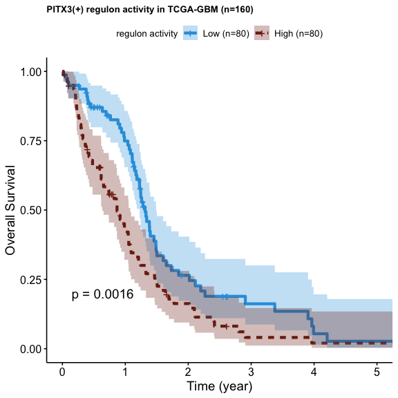
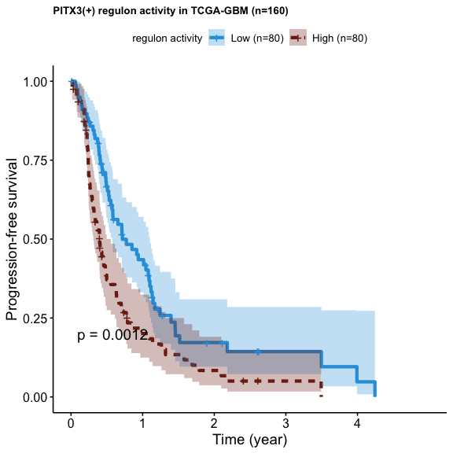
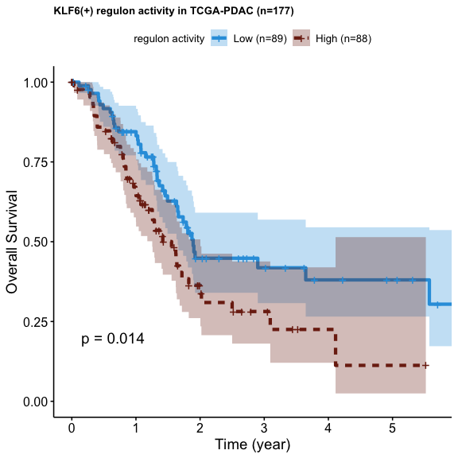
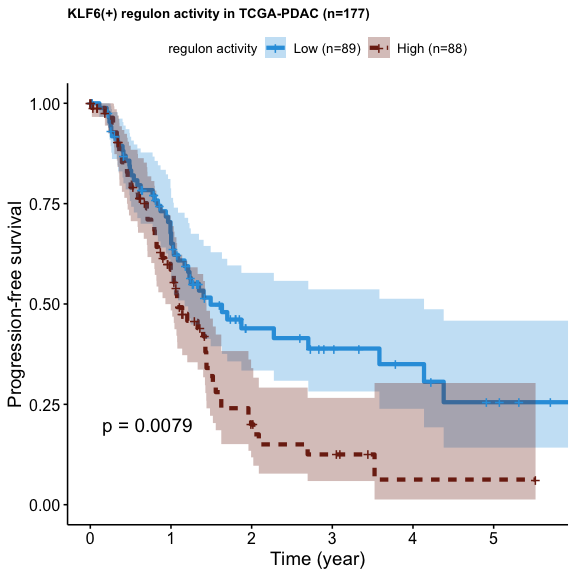

Figure 7g, The Kaplan-Meier survival curves display the validated
survival significance of regulons identified in this study across TCGA
cohorts for PITX3 in TCGA-GBM and KLF6 in TCGA-PDAC. The curves
represent the probability of survival over time for patients with high
and low expression of the corresponding regulons.
================

# 0. Load library

``` r
library(tidyverse)
library(survival)
library(survminer)
```

# 1.Prepare input data

``` r
data <-readRDS("~/Library/CloudStorage/Box-Box/Ding_Lab/Projects_Current/PanCan_snATAC/Github/data/TCGA/TCGA_GBM_regulon_validation_set_rsem.rds")
#
head(data)
```

    ## # A tibble: 6 × 386
    ##   bcr_patient_…¹ ARNT(…² ASCL1…³ ATF2(…⁴ ATF3(…⁵ ATF4(…⁶ ATF6(…⁷ ATF7(…⁸ ATOH1…⁹
    ##   <chr>            <dbl>   <dbl>   <dbl>   <dbl>   <dbl>   <dbl>   <dbl>   <dbl>
    ## 1 TCGA-02-0047    0.0520 0.0466   0.0663   0.180   0.166   0.129       0 0      
    ## 2 TCGA-02-0055    0.0339 0.00941  0.0568   0.255   0.204   0.127       0 0      
    ## 3 TCGA-02-2483    0.0434 0.0329   0.0645   0.169   0.232   0.134       0 0.00125
    ## 4 TCGA-02-2485    0.0421 0.0465   0.0601   0.190   0.187   0.120       0 0.00811
    ## 5 TCGA-02-2486    0.0364 0.0105   0.0554   0.207   0.176   0.118       0 0.00798
    ## 6 TCGA-06-0125    0.0410 0.0332   0.0608   0.202   0.167   0.123       0 0      
    ## # … with 377 more variables: `BACH2(+)` <dbl>, `BATF(+)` <dbl>,
    ## #   `BCL6(+)` <dbl>, `BHLHE22(+)` <dbl>, `BHLHE40(+)` <dbl>, `CDX1(+)` <dbl>,
    ## #   `CDX2(+)` <dbl>, `CEBPA(+)` <dbl>, `CEBPB(+)` <dbl>, `CEBPD(+)` <dbl>,
    ## #   `CEBPG(+)` <dbl>, `CENPB(+)` <dbl>, `CLOCK(+)` <dbl>, `CREB1(+)` <dbl>,
    ## #   `CREB3(+)` <dbl>, `CREB3L1(+)` <dbl>, `CREB3L4(+)` <dbl>, `CREM(+)` <dbl>,
    ## #   `CTCF(+)` <dbl>, `CTCFL(+)` <dbl>, `CUX1(+)` <dbl>, `CUX2(+)` <dbl>,
    ## #   `DLX5(+)` <dbl>, `DLX6(+)` <dbl>, `DRGX(+)` <dbl>, `E2F1(+)` <dbl>, …

# 2.Plot Figure 7g-GBM

``` r
TF_list <-"PITX3(+)"
res=NULL
cut <-0.5
# Loop through the TFs and create survival plots
for (TF in TF_list) {
  
  # Check if the column exists in the data
  if (!TF %in% colnames(data)) {
    next
  }
  # Initialize data$group as a factor with appropriate levels
  data$group <- factor(rep("", nrow(data)), levels = c(paste0(TF, " low"), paste0(TF, " high")))
  data$group[data[[TF]] > quantile(data[[TF]], 1-cut)] <- paste0(TF, " high")
  data$group[data[[TF]] <= quantile(data[[TF]], cut)] <- paste0(TF, " low")
  
  df <-data%>%drop_na(group)
  if (length(unique(df$group)) < 2) {
    next
  }
  # Cox proportional hazards model with OS as the survival outcome variable
  # and group as the predictor variable
  coxph_fit <- coxph(Surv(OS.time, OS) ~ group, data = df)
  res0=NULL
  res0 <-summary(coxph_fit)$coefficients%>%as.data.frame()
  res0$`Pr(>|z|)`<-summary(coxph_fit)$sctest[3] # replace the p value with log-rank p-value
  res=rbind(res0,res)
  
  
  # Fit survival curves for OS by group
  sfit <- survfit(Surv(OS.time, OS) ~ group, data = df)
  
  # Get the number of samples in each group
  n_high <- sum(df$group == paste0(TF, " high"))
  n_low <- sum(df$group == paste0(TF, " low"))
  
  # Determine the color order based on which group has a higher proportion of samples
  if (n_high > n_low) {
    colors <- c("#7d2613", "#2E9FDF")
  } else {
    colors <- c("#2E9FDF", "#7d2613")
  }
  
  # Determine the legend labels order based on which group has a higher proportion of samples
  if (n_high > n_low) {
    legend_labels <- c(paste0("High (n=", n_high, ")"), paste0("Low (n=", n_low, ")"))
  } else {
    legend_labels <- c(paste0("Low (n=", n_low, ")"), paste0("High (n=", n_high, ")"))
  }
  
  # Create survival plot
  p <- ggsurvplot(
    sfit,                     # survfit object with calculated statistics.
    data = df,              # data used to fit survival curves. 
    #risk.table = TRUE,        # show risk table.
    pval = TRUE,              # show p-value of log-rank test.
    conf.int = TRUE,          # show confidence intervals for point estimates of survival curves.
    xlim = c(0, 1825),        # present narrower X axis, but not affect survival estimates.
    break.time.by = 365.25,      # break X axis in time intervals by 365.
    xscale = 365.25,
    #risk.table.y.text.col = T,# colour risk table text annotations.
    #risk.table.y.text = FALSE,# show bars instead of names instead of text annotations in legend of risk table.
    ylab = "Overall Survival",
    xlab = "Time (year)",
    size = 1.5,
    linetype = "strata",      # change line type by groups
    legend = "top",
    legend.title = paste0("regulon activity"),
    palette = colors, # custom color palette
    legend.labs = legend_labels,
    title=(paste0(TF," ","regulon activity in TCGA-GBM (n=160)")),
    font.title = c(10, "bold", "black")
  )
  
}

print(p)
```

<!-- -->

``` r
  # Save plot to a pdf file
  out_dir <- '~/Library/CloudStorage/Box-Box/Ding_Lab/Projects_Current/PanCan_snATAC/Github/Fig7/figures/'
  pdf(paste(out_dir,"_",TF,"_",cut, "_TCGA_GBM_OS_survival.pdf", sep = ""), onefile = TRUE, width = 4, height = 4)
  print(p)
  dev.off()
```

    ## quartz_off_screen 
    ##                 2

``` r
## PFS

table(data$group)
```

    ## 
    ##  PITX3(+) low PITX3(+) high 
    ##            80            80

``` r
res.pfs <-NULL
# Loop through the TFs and create survival plots
for (TF in TF_list) {
  # Check if the column exists in the data
  if (!TF %in% colnames(data)) {
    next
  }
  # Initialize data$group as a factor with appropriate levels
  data$group <- factor(rep("", nrow(data)), levels = c(paste0(TF, " low"), paste0(TF, " high")))
  data$group[data[[TF]] > quantile(data[[TF]], 1-cut)] <- paste0(TF, " high")
  data$group[data[[TF]] <= quantile(data[[TF]], cut)] <- paste0(TF, " low")
  #data$group[data[[TF]] <= quantile(data[[TF]], cut)] <- paste0(TF, " low")
  df <-data%>%drop_na(group)
  if (length(unique(df$group)) < 2) {
    next
  }
  # Cox proportional hazards model with OS as the survival outcome variable
  # and group as the predictor variable
  coxph_fit <- coxph(Surv(PFI.time, PFI) ~ group, data = df)
  res0=NULL
  res0 <-summary(coxph_fit)$coefficients%>%as.data.frame()
  res0$`Pr(>|z|)`<-summary(coxph_fit)$sctest[3] # replace the p value with log-rank p-value
  res.pfs=rbind(res0,res.pfs)
  
  # Fit survival curves for PFI by group
  sfit <- survfit(Surv(PFI.time, PFI) ~ group, data = df)
  custom_theme <- function() {
    theme_survminer() %+replace%
      theme(
        plot.title=element_text(hjust=0.5),size=1
      )
  }
  
  # Get the number of samples in each group
  n_high <- sum(df$group == paste0(TF, " high"))
  n_low <- sum(df$group == paste0(TF, " low"))
  
  # Determine the color order based on which group has a higher proportion of samples
  if (n_high > n_low) {
    colors <- c("#7d2613", "#2E9FDF")
  } else {
    colors <- c("#2E9FDF", "#7d2613")
  }
  
  # Determine the legend labels order based on which group has a higher proportion of samples
  if (n_high > n_low) {
    legend_labels <- c(paste0("High (n=", n_high, ")"), paste0("Low (n=", n_low, ")"))
  } else {
    legend_labels <- c(paste0("Low (n=", n_low, ")"), paste0("High (n=", n_high, ")"))
  }
  
  
  # Create survival plot
  p2 <- ggsurvplot(
    sfit,                     # survfit object with calculated statistics.
    data = df,              # data used to fit survival curves. 
    #risk.table = TRUE,        # show risk table.
    pval = TRUE,              # show p-value of log-rank test.
    conf.int = TRUE,          # show confidence intervals for point estimates of survival curves.
    xlim = c(0, 1825),        # present narrower X axis, but not affect survival estimates.
    break.time.by = 365.25,      # break X axis in time intervals by 365.
    xscale = 365.25,
    #risk.table.y.text.col = T,# colour risk table text annotations.
    #risk.table.y.text = FALSE,# show bars instead of names instead of text annotations in legend of risk table.
    ylab = "Progression-free survival",
    xlab = "Time (year)",
    size = 1.5,
    linetype = "strata",      # change line type by groups
    legend = "top",
    #legend.title = paste0(TF," ","regulon activity"),
    legend.title = paste0("regulon activity"),
    palette = colors, # custom color palette
    legend.labs = legend_labels,
    title=(paste0(TF," ","regulon activity in TCGA-GBM (n=160)")),
    font.title = c(10, "bold", "black")
  )
}
print(p2)
```

<!-- -->

``` r
#save figure to pdf
#pdf(paste(out_dir, "Fig7g_2.pdf", sep = ""), onefile = TRUE, width = 4, height = 4)
pdf(paste(out_dir,"_",TF,"_",cut, "_TCGA_GBM_PFS_survival.pdf", sep = ""), onefile = TRUE, width = 4, height = 4)
print(p2)
dev.off()
```

    ## quartz_off_screen 
    ##                 2

# 2.Plot Figure 7g-PDAC

``` r
data <-readRDS("~/Library/CloudStorage/Box-Box/Ding_Lab/Projects_Current/PanCan_snATAC/Github/data/TCGA/TCGA_PDAC_regulon_validation_set_rsem.rds")

TF_list <-"KLF6(+)"
res=NULL
cut <-0.5

# Loop through the TFs and create survival plots
for (TF in TF_list) {
  
  # Check if the column exists in the data
  if (!TF %in% colnames(data)) {
    next
  }
  
  # Preprocess the data by categorizing samples based on the expression level of the TF
  
  # Initialize data$group as a factor with appropriate levels
  data$group <- factor(rep("", nrow(data)), levels = c(paste0(TF, " low"), paste0(TF, " high")))
  data$group[data[[TF]] > quantile(data[[TF]], 1-cut)] <- paste0(TF, " high")
  data$group[data[[TF]] <= quantile(data[[TF]], cut)] <- paste0(TF, " low")
  #data$group[data[[TF]] <= quantile(data[[TF]], cut)] <- paste0(TF, " low")
  df <-data%>%drop_na(group)
  if (length(unique(df$group)) < 2) {
    next
  }
  # Cox proportional hazards model with OS as the survival outcome variable
  # and group as the predictor variable
  coxph_fit <- coxph(Surv(OS.time, OS) ~ group, data = df)
  res0=NULL
  res0 <-summary(coxph_fit)$coefficients%>%as.data.frame()
  res0$`Pr(>|z|)`<-summary(coxph_fit)$sctest[3] # replace the p value with log-rank p-value
  res=rbind(res0,res)
  
  
  # Fit survival curves for OS by group
  sfit <- survfit(Surv(OS.time, OS) ~ group, data = df)
  
  # Get the number of samples in each group
  n_high <- sum(df$group == paste0(TF, " high"))
  n_low <- sum(df$group == paste0(TF, " low"))
  
  # Determine the color order based on which group has a higher proportion of samples
  if (n_high > n_low) {
    colors <- c("#7d2613", "#2E9FDF")
  } else {
    colors <- c("#2E9FDF", "#7d2613")
  }
  
  # Determine the legend labels order based on which group has a higher proportion of samples
  if (n_high > n_low) {
    legend_labels <- c(paste0("High (n=", n_high, ")"), paste0("Low (n=", n_low, ")"))
  } else {
    legend_labels <- c(paste0("Low (n=", n_low, ")"), paste0("High (n=", n_high, ")"))
  }
  
  # Create survival plot
  p3 <- ggsurvplot(
    sfit,                     # survfit object with calculated statistics.
    data = df,              # data used to fit survival curves. 
    #risk.table = TRUE,        # show risk table.
    pval = TRUE,              # show p-value of log-rank test.
    conf.int = TRUE,          # show confidence intervals for point estimates of survival curves.
    xlim = c(0, 2060),        # present narrower X axis, but not affect survival estimates.
    break.time.by = 365.25,      # break X axis in time intervals by 365.
    xscale = 365.25,
    #risk.table.y.text.col = T,# colour risk table text annotations.
    #risk.table.y.text = FALSE,# show bars instead of names instead of text annotations in legend of risk table.
    ylab = "Overall Survival",
    xlab = "Time (year)",
    size = 1.5,
    linetype = "strata",      # change line type by groups
    legend = "top",
    #legend.title = paste0(TF," ","regulon activity"),
    legend.title = paste0("regulon activity"),
    palette = colors, # custom color palette
    legend.labs = legend_labels,
    title=(paste0(TF," ","regulon activity in TCGA-PDAC (n=177)")),
    font.title = c(10, "bold", "black")
  )
}

print(p3)
```

<!-- -->

``` r
  # Save plot to a pdf file
  pdf(paste(out_dir, TF,"_",cut, "_TCGA_PDAC_OS_survival_v4.pdf", sep = ""), onefile = TRUE, width = 4, height = 4)
  print(p3)
  dev.off()
```

    ## quartz_off_screen 
    ##                 2

``` r
## PFS
table(data$group)
```

    ## 
    ##  KLF6(+) low KLF6(+) high 
    ##           89           88

``` r
res.pfs <-NULL
# Loop through the TFs and create survival plots
for (TF in TF_list) {
  
  # Check if the column exists in the data
  if (!TF %in% colnames(data)) {
    next
  }
  
  # Preprocess the data by categorizing samples based on the expression level of the TF
  # Initialize data$group as a factor with appropriate levels
  data$group <- factor(rep("", nrow(data)), levels = c(paste0(TF, " low"), paste0(TF, " high")))
  data$group[data[[TF]] > quantile(data[[TF]], 1-cut)] <- paste0(TF, " high")
  data$group[data[[TF]] <= quantile(data[[TF]], cut)] <- paste0(TF, " low")
  #data$group[data[[TF]] <= quantile(data[[TF]], cut)] <- paste0(TF, " low")
  df <-data%>%drop_na(group)
  if (length(unique(df$group)) < 2) {
    next
  }
  # Cox proportional hazards model with OS as the survival outcome variable
  # and group as the predictor variable
  coxph_fit <- coxph(Surv(PFI.time, PFI) ~ group, data = df)
  res0=NULL
  res0 <-summary(coxph_fit)$coefficients%>%as.data.frame()
  res0$`Pr(>|z|)`<-summary(coxph_fit)$sctest[3] # replace the p value with log-rank p-value
  res.pfs=rbind(res0,res.pfs)
  
  # Fit survival curves for PFI by group
  sfit <- survfit(Surv(PFI.time, PFI) ~ group, data = df)
  custom_theme <- function() {
    theme_survminer() %+replace%
      theme(
        plot.title=element_text(hjust=0.5),size=1
      )
  }
  
  # Get the number of samples in each group
  n_high <- sum(df$group == paste0(TF, " high"))
  n_low <- sum(df$group == paste0(TF, " low"))
  
  # Determine the color order based on which group has a higher proportion of samples
  if (n_high > n_low) {
    colors <- c("#7d2613", "#2E9FDF")
  } else {
    colors <- c("#2E9FDF", "#7d2613")
  }
  
  # Determine the legend labels order based on which group has a higher proportion of samples
  if (n_high > n_low) {
    legend_labels <- c(paste0("High (n=", n_high, ")"), paste0("Low (n=", n_low, ")"))
  } else {
    legend_labels <- c(paste0("Low (n=", n_low, ")"), paste0("High (n=", n_high, ")"))
  }
  
  # Create survival plot
  p4 <- ggsurvplot(
    sfit,                     # survfit object with calculated statistics.
    data = df,              # data used to fit survival curves. 
    #risk.table = TRUE,        # show risk table.
    pval = TRUE,              # show p-value of log-rank test.
    conf.int = TRUE,          # show confidence intervals for point estimates of survival curves.
    xlim = c(0, 2060),        # present narrower X axis, but not affect survival estimates.
    break.time.by = 365.25,      # break X axis in time intervals by 365.
    xscale = 365.25,
    #risk.table.y.text.col = T,# colour risk table text annotations.
    #risk.table.y.text = FALSE,# show bars instead of names instead of text annotations in legend of risk table.
    ylab = "Progression-free survival",
    xlab = "Time (year)",
    size = 1.5,
    linetype = "strata",      # change line type by groups
    legend = "top",
    #legend.title = paste0(TF," ","regulon activity"),
    legend.title = paste0("regulon activity"),
    palette = colors, # custom color palette
    legend.labs = legend_labels,
    title=(paste0(TF," ","regulon activity in TCGA-PDAC (n=177)")),
    font.title = c(10, "bold", "black")
  )
  
}

print(p4)
```

<!-- -->

``` r
  # Save plot to a pdf file
  pdf(paste(out_dir, TF,"_",cut, "_TCGA_PDAC_PFS_survival_v4.pdf", sep = ""), onefile = TRUE, width = 4, height = 4)
  print(p4)
  dev.off()
```

    ## quartz_off_screen 
    ##                 2
